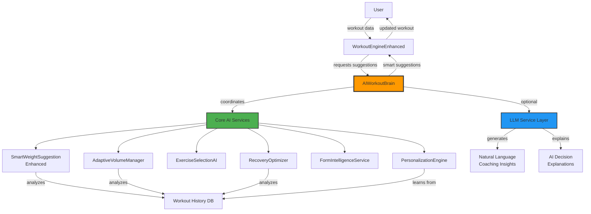
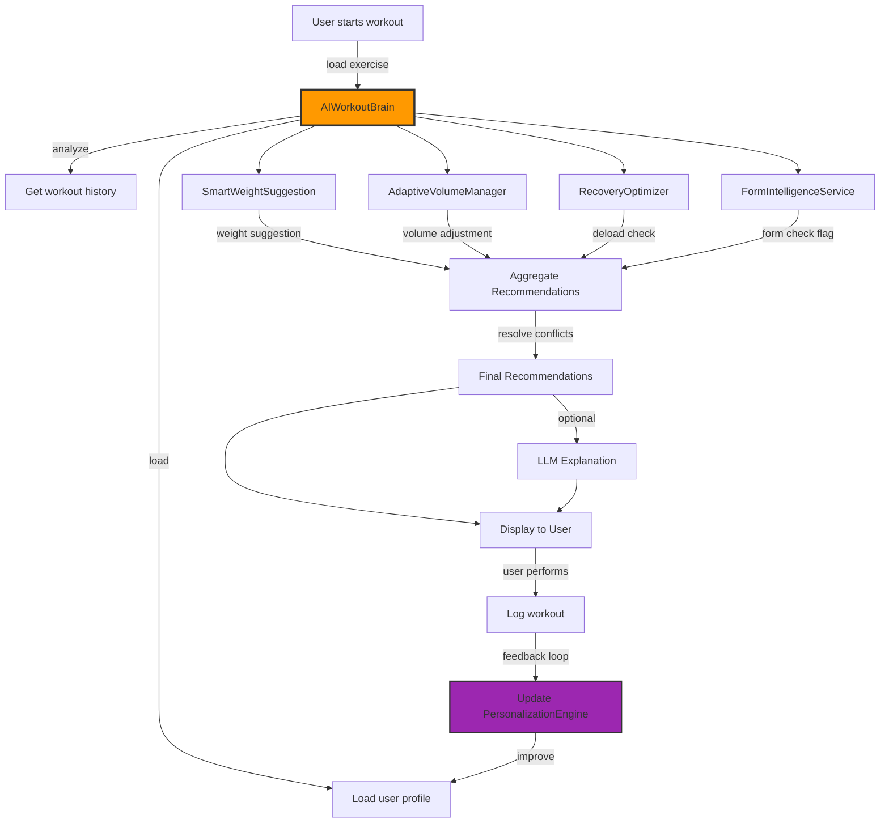

# AI Workout Engine Integration Plan

## Executive Summary

This plan outlines the integration of an intelligent AI engine into the existing WorkoutEngineEnhanced system. The design uses a **hybrid approach**: deterministic rule-based algorithms for real-time workout decisions, enhanced with optional LLM integration for natural language coaching and insights.

**Key Goals:**
- Make weight and exercise suggestions truly "smart" and adaptive
- Learn from user patterns and personalize recommendations
- Predict fatigue, recovery needs, and optimal progression
- Provide natural language coaching insights
- Maintain fast, deterministic core operations
- Enable offline functionality for critical features

---

## Architecture Overview



---

## Core AI Components

### 1. AIWorkoutBrain (Central Intelligence Coordinator)

**Purpose:** Central orchestration service that coordinates all AI decisions and provides unified interface.

**Key Responsibilities:**
- Aggregate signals from all AI services
- Resolve conflicting recommendations using priority system
- Provide unified API for workout suggestions
- Cache and optimize AI decisions
- Manage LLM integration when available

**Example API:**
```typescript
interface AIWorkoutBrain {
  // Main decision endpoint
  getSuggestedWorkout(context: WorkoutContext): SmartWorkoutPlan;
  
  // Component decisions
  getSuggestedWeight(exerciseId: string, context: WeightContext): WeightSuggestion;
  getSuggestedVolume(exerciseId: string, context: VolumeContext): VolumeSuggestion;
  shouldDeload(userId: string): DeloadRecommendation;
  suggestExerciseAlternatives(exerciseId: string, reason: string): ExerciseAlternative[];
  
  // Coaching insights (LLM-enhanced)
  getCoachingInsight(workout: WorkoutSession): Promise<CoachingInsight>;
  explainDecision(decision: AIDecision): Promise<string>;
}
```

**Intelligence Features:**
- Multi-factor decision weighting
- Confidence scoring for all recommendations
- Fallback strategies when data is limited
- Learning from user acceptance/rejection of suggestions

---

### 2. SmartWeightSuggestionService (Enhanced)

**Current State:** Basic fatigue detection, rest day adjustments, trend analysis

**Enhancements:**

#### A. Advanced Pattern Recognition
```typescript
interface PatternRecognition {
  // Detect micro-cycles in performance (weekly patterns)
  detectWeeklyCycle(history: WorkoutHistory): PerformanceCycle;
  
  // Identify optimal weight increments for individual
  calculatePersonalizedIncrement(exerciseId: string): number; // Not always 5 lbs
  
  // Detect plateau and recommend break-through strategies
  detectPlateau(exerciseId: string): PlateauAnalysis;
  
  // Identify exercise-specific response patterns
  analyzeExerciseResponse(exerciseId: string): ResponsePattern;
}
```

#### B. Multi-Variable Weighting System
```typescript
interface WeightFactors {
  // Current factors (already implemented)
  fatigueScore: number;          // 0-1, weight: 0.30
  restDays: number;              // weight: 0.20
  performanceTrend: string;      // weight: 0.25
  
  // NEW factors to add
  timeOfDay: number;             // Morning vs evening, weight: 0.05
  weekInCycle: number;           // Week 1-4 position, weight: 0.10
  nutritionScore?: number;       // If tracked, weight: 0.05
  sleepQuality?: number;         // If tracked, weight: 0.10
  muscleGroupFatigue: number;    // Systemic fatigue, weight: 0.15
  historicalVolume: number;      // Recent volume accumulation, weight: 0.10
}
```

#### C. Predictive Weight Suggestions
```typescript
// Predict optimal weight 3-7 days ahead
predictFuturePerformance(
  exerciseId: string,
  daysAhead: number
): WeightPrediction;

// Suggest weight based on goal
suggestWeightByGoal(
  exerciseId: string,
  goal: 'strength' | 'hypertrophy' | 'endurance'
): WeightSuggestion;
```

---

### 3. AdaptiveVolumeManager (NEW)

**Purpose:** Intelligently adjust total training volume (sets × reps × weight) based on user capacity and recovery.

**Key Features:**

#### A. Dynamic Set/Rep Adjustment
```typescript
interface VolumeRecommendation {
  adjustedSets: number;          // May increase/decrease from template
  adjustedReps: number[];        // Per-set rep targets
  intensityModifier: number;     // 0.85-1.15 multiplier
  reasoning: string;
  confidence: 'high' | 'medium' | 'low';
}

// Example: User showing fatigue
// Template: 4 sets × 8 reps @ 80%
// AI suggests: 3 sets × 6 reps @ 75% (reduced volume)
```

#### B. Volume Accumulation Tracking
```typescript
// Track weekly/monthly volume per muscle group
trackVolumeAccumulation(
  muscleGroup: MuscleGroup,
  timeframe: 'week' | 'month'
): VolumeMetrics;

// Recommend volume adjustments
recommendVolumeAdjustment(
  muscleGroup: MuscleGroup,
  currentVolume: number
): VolumeAdjustment;
```

#### C. Autoregulation Logic
```typescript
// Adjust mid-workout based on performance
autoregulateVolume(
  exerciseLog: ExerciseLog,
  completedSets: SetLog[]
): VolumeAdjustment;

// Example: If sets 1-2 below target reps
// Suggest reducing weight by 5-10% for remaining sets
// OR reduce total sets from 4 to 3
```

---

### 4. ExerciseSelectionAI (NEW)

**Purpose:** Suggest optimal exercise alternatives based on fatigue, equipment, muscle balance, and variety.

**Key Features:**

#### A. Fatigue-Based Substitutions
```typescript
interface ExerciseSubstitution {
  reason: 'fatigue' | 'equipment' | 'variety' | 'injury' | 'plateau';
  originalExercise: Exercise;
  recommendedAlternatives: Exercise[];
  equipmentAdjustment: boolean;
  intensityAdjustment: number;
}

// Example: User shows shoulder fatigue
// Original: Overhead Press
// Suggest: Landmine Press (reduced shoulder stress)
```

#### B. Muscle Balance Optimization
```typescript
// Detect muscle group imbalances
analyzeMuscleBa
lance(userId: string): MuscleBalanceReport;

// Suggest exercises to address imbalances
recommendBalancingExercises(
  muscleGroup: MuscleGroup
): Exercise[];

// Example: Detect over-developed chest vs back
// Increase back volume, suggest more rowing variations
```

#### C. Exercise Variety Intelligence
```typescript
// Prevent exercise staleness
trackExerciseFrequency(exerciseId: string): FrequencyMetrics;

// Suggest variations after N weeks
suggestExerciseVariation(
  exerciseId: string,
  weeksUsed: number
): Exercise[];

// Example: After 6 weeks of Barbell Bench Press
// Suggest: Dumbbell Bench, Incline Bench, or Close Grip
```

---

### 5. RecoveryOptimizer (NEW)

**Purpose:** Predict optimal deload timing and recovery strategies using multiple fatigue indicators.

**Key Features:**

#### A. Predictive Deload Recommendations
```typescript
interface DeloadPrediction {
  shouldDeload: boolean;
  confidence: number;           // 0-1
  recommendedTiming: number;    // days from now
  deloadType: 'volume' | 'intensity' | 'both';
  duration: number;             // suggested deload days
  reasoning: string[];
}

// Multi-factor analysis
analyzeDeloadNeed(userId: string): DeloadPrediction;

// Factors considered:
// - Consecutive weeks of high intensity (>4 weeks)
// - Performance decline across multiple exercises
// - Low sleep quality (if tracked)
// - High training volume accumulation
// - Subjective fatigue scores
// - Recovery velocity (how quickly performance rebounds)
```

#### B. Recovery Velocity Tracking
```typescript
// Track how quickly user recovers between sessions
trackRecoveryVelocity(
  exerciseId: string,
  sessionGap: number
): RecoveryMetrics;

// Personalized rest recommendations
recommendRestPeriod(
  exerciseId: string,
  muscleGroup: MuscleGroup
): number; // days

// Example: User A fully recovers in 48h
// User B needs 72h for same stimulus
```

#### C. Active Recovery Suggestions
```typescript
// Suggest active recovery when appropriate
suggestActiveRecovery(
  fatigueLevel: number
): RecoveryActivity[];

// Options: light cardio, mobility work, yoga, etc.
```

---

### 6. FormIntelligenceService (NEW)

**Purpose:** Analyze performance patterns to detect form degradation and recommend intervention.

**Key Features:**

#### A. Form Degradation Detection
```typescript
interface FormAnalysis {
  formQualityScore: number;      // 0-1
  degradationDetected: boolean;
  concernedMetrics: string[];
  recommendation: FormRecommendation;
}

// Detect form issues from performance patterns
analyzeFormFromPerformance(
  exerciseLog: ExerciseLog
): FormAnalysis;

// Indicators of form issues:
// - Sudden weight drops
// - Inconsistent rep completion across sets
// - Significant performance variance session-to-session
// - Inability to hit minimum reps at expected weight
```

#### B. Video Review Triggers
```typescript
// Trigger video review recommendations
shouldReviewForm(
  exerciseId: string,
  recentHistory: WorkoutHistory
): FormReviewRecommendation;

// Trigger conditions:
// - New exercise (first 2 sessions)
// - Weight increase >15%
// - Performance decline >20%
// - User requests form check
// - Every N weeks (maintenance check)
```

#### C. Progressive Loading Safety
```typescript
// Ensure safe weight progressions
validateWeightProgression(
  previousWeight: number,
  suggestedWeight: number,
  exerciseType: ExerciseType
): ProgressionValidation;

// Flag aggressive progressions
// Suggest form review before attempting
```

---

### 7. PersonalizationEngine (NEW)

**Purpose:** Learn user-specific response patterns and continuously adapt recommendations.

**Key Features:**

#### A. Individual Response Profiling
```typescript
interface UserProfile {
  // How user responds to training stimuli
  progressionRate: number;       // Fast/average/slow gainer
  recoveryCapacity: number;      // How quickly recovers
  volumeTolerance: number;       // High/medium/low volume responder
  intensityPreference: number;   // Responds better to intensity vs volume
  
  // Exercise-specific responses
  exerciseResponses: Map<string, ExerciseResponse>;
  
  // Temporal patterns
  bestTrainingTime: string;      // Morning/afternoon/evening
  weeklyPerformanceCycle: PerformanceCycle;
}

// Build profile over time
buildUserProfile(userId: string): UserProfile;

// Update profile after each workout
updateProfile(userId: string, workout: WorkoutSession): void;
```

#### B. Adaptive Learning
```typescript
// Learn from user behavior
learnFromUserFeedback(
  suggestion: AIDecision,
  userAction: 'accepted' | 'modified' | 'rejected',
  actualResult: WorkoutResult
): void;

// Example: AI suggests +10 lbs
// User modifies to +5 lbs and succeeds
// AI learns this user prefers conservative progressions
```

#### C. Goal-Aligned Optimization
```typescript
// Tailor suggestions to user goals
optimizeForGoal(
  userId: string,
  goal: 'strength' | 'hypertrophy' | 'endurance' | 'general'
): OptimizationStrategy;

// Adjust volume/intensity ratios based on goal
// Strength: Lower volume, higher intensity (85-95% 1RM)
// Hypertrophy: Moderate volume, moderate intensity (65-85% 1RM)
// Endurance: Higher volume, lower intensity (50-70% 1RM)
```

---

## LLM Integration Layer

**Purpose:** Enhance user experience with natural language coaching insights and explanations.

### Architecture

```typescript
interface LLMService {
  // Generate personalized coaching insights
  generateCoachingInsight(
    workout: WorkoutSession,
    userProfile: UserProfile,
    aiDecisions: AIDecision[]
  ): Promise<CoachingInsight>;
  
  // Explain AI decisions in natural language
  explainDecision(
    decision: AIDecision,
    context: DecisionContext
  ): Promise<string>;
  
  // Generate motivational messages
  generateMotivation(
    userProgress: ProgressMetrics,
    recentChallenges: Challenge[]
  ): Promise<MotivationalMessage>;
  
  // Answer user questions about their training
  answerTrainingQuestion(
    question: string,
    userContext: UserContext
  ): Promise<string>;
}
```

### LLM Use Cases

#### 1. Post-Workout Insights
```typescript
// After workout completion
const insight = await llmService.generateCoachingInsight(session, profile, decisions);

// Example output:
// "Great session today! You hit a new PR on bench press (185 lbs).
// Your chest pressing strength is progressing well (+15 lbs over 4 weeks).
// The AI reduced your accessory volume today because it detected 
// shoulder fatigue from Monday's session - smart move to prioritize recovery.
// Next session, we'll attempt 190 lbs if you're feeling recovered."
```

#### 2. Decision Explanations
```typescript
// When AI suggests something unexpected
const explanation = await llmService.explainDecision(decision, context);

// Example: AI suggests reducing weight
// "I'm recommending a 10 lb reduction today because:
// 1. You've had 3 consecutive intense sessions without full recovery
// 2. Your performance on the first two sets today was 15% below normal
// 3. You're in week 4 of a hard training block - cumulative fatigue is building
// This tactical reduction will help you finish strong and set up next week's PR attempt."
```

#### 3. Form and Technique Coaching
```typescript
// Generate exercise-specific cues
const formCues = await llmService.generateFormCues(exercise, userHistory);

// Example: Bench Press
// "Focus points for today's bench press:
// - Keep your shoulder blades retracted and depressed
// - Drive through your legs to maintain full-body tension
// - Lower the bar with control (2-3 seconds)
// - Touch your chest at nipple line
// - Press explosively but maintain control
// 
// Watch for: You tend to lose tightness on sets 3-4. Reset your setup before each rep."
```

#### 4. Motivational Coaching
```typescript
// Personalized motivation
const motivation = await llmService.generateMotivation(progress, challenges);

// Example:
// "You're in the middle of a breakthrough phase! Your squat has increased
// 25 lbs in 6 weeks - that's exceptional progress. The next 2 weeks will be
// challenging as weights get heavier, but your consistency has been outstanding.
// Trust the process, focus on form, and you'll hit 315 lbs by month-end."
```

### Implementation Strategy

**Option 1: OpenAI GPT Integration**
```typescript
// Using OpenAI API
import OpenAI from 'openai';

const openai = new OpenAI({
  apiKey: process.env.OPENAI_API_KEY
});

async function generateInsight(context: WorkoutContext): Promise<string> {
  const response = await openai.chat.completions.create({
    model: "gpt-4-turbo-preview",
    messages: [
      {
        role: "system",
        content: "You are an expert strength coach analyzing workout data..."
      },
      {
        role: "user",
        content: JSON.stringify(context)
      }
    ],
    temperature: 0.7,
    max_tokens: 500
  });
  
  return response.choices[0].message.content;
}
```

**Option 2: Local LLM (Offline Support)**
```typescript
// Using Ollama or similar for on-device inference
import { Ollama } from 'ollama';

const ollama = new Ollama();

async function generateInsightOffline(context: WorkoutContext): Promise<string> {
  const response = await ollama.generate({
    model: 'mistral',
    prompt: `As a strength coach, analyze this workout: ${JSON.stringify(context)}`
  });
  
  return response.response;
}
```

**Fallback Strategy:**
- LLM features are **optional** and enhance UX
- Core AI decisions work without LLM
- Cache common LLM responses for offline use
- Gracefully degrade to rule-based explanations

---

## Integration with WorkoutEngineEnhanced

### Before (Current State)
```typescript
// Direct formula calculations
const weight = FormulaCalculator.calculateWeightByPercentage(fourRepMax, 0.80);
const sets = this.generateWorkoutSets(exerciseId, fourRepMax);
```

### After (AI-Enhanced)
```typescript
// AI-driven suggestions
const aiContext = {
  userId,
  exerciseId,
  fourRepMax,
  recentHistory,
  userProfile,
  currentWeek,
  fatigueIndicators
};

// Get AI recommendations
const recommendations = await AIWorkoutBrain.getSuggestedWorkout(aiContext);

// AI decides:
// - Optimal weight (may deviate from formula if fatigue detected)
// - Number of sets (may reduce if volume is high)
// - Exercise alternatives (if needed)
// - Rest periods (personalized)
// - Whether to attempt max or do volume work

const weight = recommendations.suggestedWeight;
const sets = recommendations.adjustedSets;
const alternatives = recommendations.exerciseAlternatives;
```

### Decision Flow



---

## Data Models

### AI Decision Context
```typescript
interface AIDecisionContext {
  // User data
  userId: string;
  userProfile: UserProfile;
  userGoal: TrainingGoal;
  
  // Exercise data
  exerciseId: string;
  fourRepMax: number;
  exerciseHistory: ExerciseLog[];
  
  // Session context
  currentWeek: number;
  dayNumber: number;
  timeOfDay: number;
  
  // Recovery data
  daysSinceLastSession: number;
  sleepQuality?: number;
  nutritionScore?: number;
  subjectiveFatigue?: number;
  
  // Volume tracking
  recentVolume: VolumeMetrics;
  muscleGroupFatigue: Map<MuscleGroup, number>;
  
  // Program context
  weekInCycle: number;
  deloadDue: boolean;
}
```

### AI Recommendation Output
```typescript
interface AIRecommendation {
  // Core suggestions
  suggestedWeight: number;
  adjustedSets: number;
  adjustedReps: number[];
  suggestedRestPeriods: number[];
  
  // Alternatives
  exerciseAlternatives?: ExerciseAlternative[];
  
  // Intelligence metadata
  confidence: number;           // 0-1
  reasoning: string[];          // Human-readable reasons
  warningFlags: Warning[];      // Fatigue, form concerns, etc.
  
  // Optional coaching
  coachingInsight?: string;     // LLM-generated
  formCues?: string[];          // LLM-generated
  
  // Decision factors (for transparency)
  factors: {
    fatigueScore: number;
    recoveryScore: number;
    progressionRate: number;
    volumeAccumulation: number;
    performanceTrend: string;
  };
}
```

### User Profile (Personalization)
```typescript
interface UserProfile {
  userId: string;
  createdAt: number;
  lastUpdated: number;
  
  // Learned characteristics
  progressionRate: number;      // 0.5-2.0 (1.0 = average)
  recoveryCapacity: number;     // 0.5-2.0 (1.0 = average)
  volumeTolerance: number;      // 0.5-2.0 (1.0 = average)
  
  // Exercise-specific learning
  exerciseProfiles: Map<string, {
    personalIncrement: number;  // May differ from standard 5 lbs
    optimalVolume: number;      // Sets per session
    optimalFrequency: number;   // Sessions per week
    plateauThreshold: number;   // Weeks before suggesting change
  }>;
  
  // Temporal patterns
  bestPerformanceTime: string;  // Morning/afternoon/evening
  weeklyPattern: number[];      // Performance by day of week
  
  // Preferences (learned from user behavior)
  prefersConservativeProgression: boolean;
  acceptsAIsuggestions: number; // 0-1, how often accepts
  modificationPatterns: string[]; // Common adjustments user makes
}
```

---

## Key Intelligence Features

### 1. Smart Weight Progression
- **Not just formula-based** - considers fatigue, recovery, and patterns
- **Personalized increments** - some users progress faster/slower
- **Predictive** - suggests next session's weight in advance
- **Confidence-scored** - tells user how confident the AI is

### 2. Adaptive Volume Management
- **Autoregulation** - adjusts mid-workout based on performance
- **Volume accumulation tracking** - prevents overtraining
- **Muscle group balancing** - ensures balanced development
- **Goal-aligned** - different volume for strength vs hypertrophy

### 3. Intelligent Exercise Selection
- **Fatigue-aware** - suggests easier variations when tired
- **Variety management** - prevents staleness
- **Equipment adaptation** - adjusts for available equipment
- **Plateau breaking** - suggests variations when progress stalls

### 4. Recovery Optimization
- **Predictive deload** - recommends before user burns out
- **Personalized rest** - learns individual recovery rates
- **Active recovery** - suggests appropriate activities
- **Volume tapering** - strategically reduces volume when needed

### 5. Form Intelligence
- **Performance-based detection** - spots form issues from data
- **Proactive intervention** - suggests video review before injury
- **Progressive loading safety** - validates weight jumps
- **Technique reminders** - contextual form cues

### 6. Continuous Learning
- **Adapts to user** - learns from every workout
- **Improves over time** - recommendations get better with data
- **Feedback integration** - learns from user modifications
- **Pattern recognition** - identifies what works for individual

---

## Implementation Phases

### Phase 1: Core AI Services (Foundation)
1. ✅ Enhance SmartWeightSuggestionService with pattern recognition
2. ✅ Create AdaptiveVolumeManager for dynamic set/rep adjustment
3. ✅ Implement RecoveryOptimizer for deload predictions
4. ✅ Build FormIntelligenceService for form detection

### Phase 2: Intelligence Coordination
5. ✅ Create AIWorkoutBrain as central coordinator
6. ✅ Implement PersonalizationEngine with user profiling
7. ✅ Integrate all AI services into unified recommendation system

### Phase 3: LLM Enhancement
8. ✅ Implement LLMService wrapper (OpenAI integration)
9. ✅ Add coaching insights generation
10. ✅ Create explanation system for AI decisions
11. ✅ Build offline fallback strategies

### Phase 4: Integration & Testing
12. ✅ Update WorkoutEngineEnhanced to use AI brain
13. ✅ Create comprehensive test suite
14. ✅ Build UI components for AI recommendations
15. ✅ Add user feedback collection mechanisms

### Phase 5: Learning & Optimization
16. ✅ Implement continuous learning pipeline
17. ✅ Build analytics dashboard for AI performance
18. ✅ Optimize decision-making algorithms based on real data

---

## Success Metrics

### AI Performance
- **Suggestion acceptance rate** - % of times user accepts AI suggestion
- **Workout completion rate** - % of workouts completed successfully
- **PR frequency** - How often users hit personal records
- **Injury/setback rate** - Should decrease with better recovery management

### User Experience
- **Session satisfaction** - User ratings after workouts
- **Progression rate** - Speed of strength gains
- **Adherence rate** - Consistency of training
- **Feature usage** - How often users engage with AI features

### Technical
- **Response time** - AI decisions should be <100ms (excluding LLM)
- **Accuracy** - Predicted performance vs actual
- **Confidence calibration** - Are high-confidence suggestions more accurate?

---

## Risk Mitigation

### Over-Reliance on AI
- **Solution:** Always show reasoning, allow user override
- **Fallback:** Can disable AI and use pure formula-based system

### Data Privacy
- **Solution:** All learning happens locally, no user data shared
- **LLM integration:** User data anonymized, only workout stats sent

### Incorrect Suggestions
- **Solution:** Confidence scoring, gradual rollout, extensive testing
- **Safeguards:** Hard limits on weight changes, volume bounds

### LLM Costs/Availability
- **Solution:** Optional feature, cached responses, offline fallback
- **Alternative:** Local LLM for on-device generation

---

## Next Steps

1. **Review this plan** - Confirm approach aligns with vision
2. **Prioritize features** - Which AI components are most important?
3. **Implementation order** - Start with foundation, build up
4. **Testing strategy** - How to validate AI decisions?
5. **LLM decision** - OpenAI, local model, or both?

This hybrid AI approach will make your workout engine truly intelligent while maintaining the reliability and performance of your existing formula-based system.
