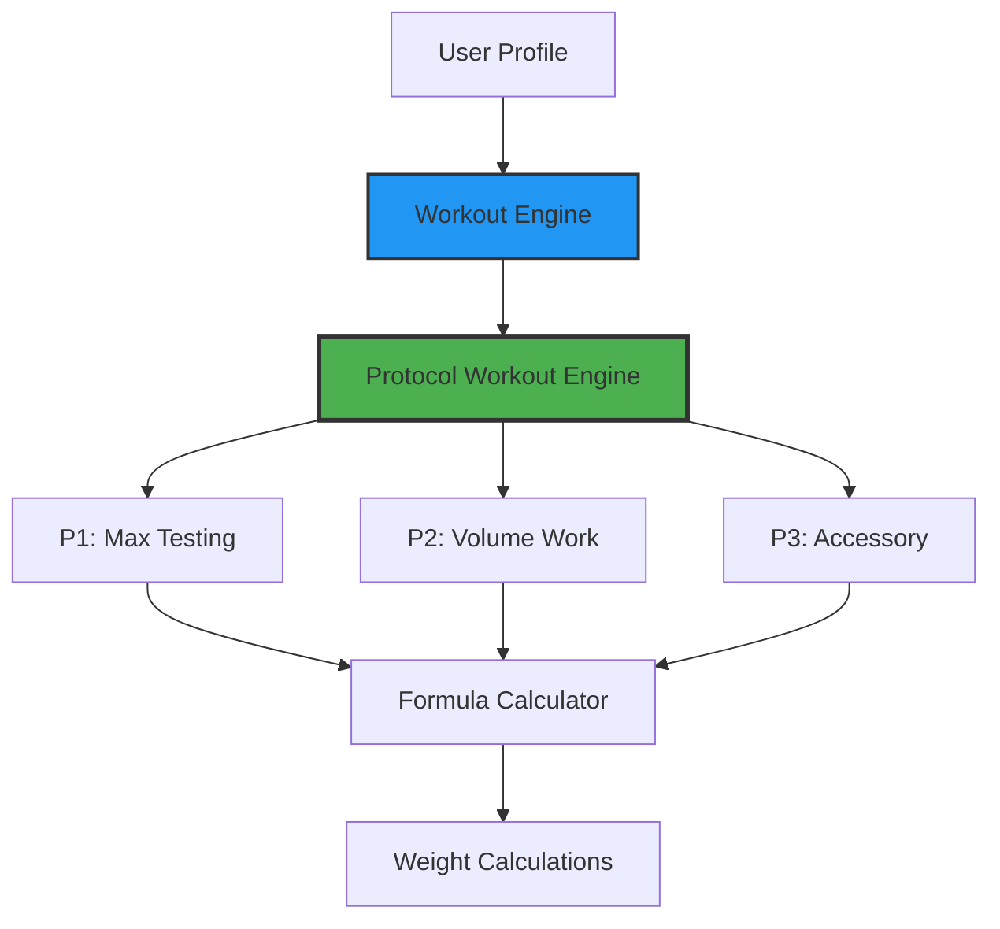

# Protocol-Only System Consolidation Plan

## Executive Summary

This plan consolidates the training system to use **ONLY the Protocol system (P1/P2/P3)** for main lifts and formulas, removing the dual-mode architecture (percentage mode vs protocol mode) entirely.

**Goal:** Replace the old percentage-based system with the protocol system as the sole training methodology.

---

## Current State Analysis

### Dual-Mode Architecture Components

**Files with Training Mode References (93 total):**

1. **Type Definitions**
   - `app/src/types/index.ts` - TrainingMode type, UserProfile.trainingMode
   
2. **Redux State Management**
   - `app/src/store/slices/userSlice.ts` - trainingMode field, setTrainingMode action

3. **Onboarding Flow**
   - `app/src/screens/onboarding/TrainingModeOnboardingScreen.tsx` - Mode selection screen
   - `app/src/screens/onboarding/WelcomeScreen.tsx` - Navigation to mode selection
   - `app/src/navigation/MainNavigator.tsx` - TrainingModeOnboarding route

4. **Settings & Configuration**
   - `app/src/screens/settings/TrainingModeSettingsScreen.tsx` - Mode switching interface
   - `app/src/screens/settings/SettingsScreen.tsx` - Link to mode settings
   - `app/src/navigation/MainNavigator.tsx` - TrainingModeSettings route

5. **UI Components**
   - `app/src/components/workout/TrainingModeSelector.tsx` - Mode selection modal
   - `app/src/components/workout/ModeMigrationWizard.tsx` - Migration wizard

6. **Services**
   - `app/src/services/WorkoutEngineRouter.ts` - Routes between percentage/protocol
   - `app/src/services/ModeMigrationService.ts` - Handles mode conversion
   - `app/src/services/ProtocolAnalyticsService.ts` - Compares mode performance
   - `app/src/services/WorkoutEngine.ts` - Maintains backward compatibility

7. **Analytics**
   - `app/src/screens/analytics/ModeComparisonScreen.tsx` - Comparison dashboard

---

## Target State Architecture

### Protocol-Only System

```typescript
// BEFORE: Dual mode
interface UserProfile {
  trainingMode: 'percentage' | 'protocol';  // ❌ Remove this
  maxLifts: Record<string, MaxLift>;
  // ...
}

// AFTER: Protocol only
interface UserProfile {
  // trainingMode removed - protocol is implied
  fourRepMaxes: Record<string, FourRepMax>;  // Primary max tracking
  maxLifts: Record<string, MaxLift>;         // For reference/conversion only
  // ...
}
```

### Simplified Workout Engine Flow



**Key Changes:**
- WorkoutEngine directly uses ProtocolWorkoutEngine
- FormulaCalculator becomes a utility FOR protocol system (not an alternative)
- No router needed - direct protocol execution

---

## Implementation Plan

### Phase 1: Type System Cleanup

**Files to Modify:**

1. **`app/src/types/index.ts`**
   ```typescript
   // REMOVE or deprecate:
   export type TrainingMode = 'percentage' | 'protocol';
   
   // UPDATE UserProfile:
   export interface UserProfile {
     // Remove: trainingMode: TrainingMode;
     
     // Keep/enhance:
     fourRepMaxes: Record<string, FourRepMax>;  // Primary
     maxLifts: Record<string, MaxLift>;         // Legacy/reference
     protocolPreferences: ProtocolPreferences;
   }
   ```

2. **`app/src/store/slices/userSlice.ts`**
   ```typescript
   // REMOVE:
   // - setTrainingMode action
   // - trainingMode from initializeProfile
   // - trainingMode field from state
   
   // UPDATE:
   initializeProfile: (state, action: PayloadAction<{ 
     userId: string; 
     currentPhase: string;
     // Remove: trainingMode?: TrainingMode
   }>) => {
     state.profile = {
       // Remove: trainingMode
       // All users now use protocol system
     };
   }
   ```

### Phase 2: Remove Mode Selection UI

**Files to Remove/Archive:**

1. **`app/src/screens/onboarding/TrainingModeOnboardingScreen.tsx`**
   - Archive this entire file (move to `deprecated/`)
   - Users go directly from Welcome → Max Determination

2. **`app/src/screens/settings/TrainingModeSettingsScreen.tsx`**
   - Archive this entire file
   - Remove from settings menu

3. **`app/src/components/workout/TrainingModeSelector.tsx`**
   - Archive this entire file
   - No longer needed

4. **`app/src/components/workout/ModeMigrationWizard.tsx`**
   - Archive this entire file
   - Migration no longer relevant

**Files to Update:**

5. **`app/src/screens/onboarding/WelcomeScreen.tsx`**
   ```typescript
   const handleGetStarted = () => {
     // OLD: navigation.navigate('TrainingModeOnboarding');
     // NEW: navigation.navigate('MaxDeterminationIntro');
   };
   ```

6. **`app/src/screens/settings/SettingsScreen.tsx`**
   ```typescript
   // REMOVE this list item:
   // <List.Item
   //   title="Training Mode"
   //   onPress={() => navigation.navigate('TrainingModeSettings')}
   // />
   ```

7. **`app/src/navigation/MainNavigator.tsx`**
   ```typescript
   // REMOVE these routes:
   // <RootStack.Screen name="TrainingModeOnboarding" component={...} />
   // <ProfileStack.Screen name="TrainingModeSettings" component={...} />
   ```

### Phase 3: Simplify Workout Engine

**Files to Modify:**

1. **`app/src/services/WorkoutEngine.ts`**
   ```typescript
   // REMOVE backward compatibility comments
   // DIRECTLY use ProtocolWorkoutEngine
   
   export class WorkoutEngine {
     static async createWorkoutSession(
       userId: string,
       weekNumber: number,
       dayNumber: number,
       day: Day,
       fourRepMaxes: Record<string, FourRepMax>,  // Use 4RMs, not 1RMs
       bodyWeight?: number
     ): Promise<WorkoutSession> {
       // Direct protocol execution
       return ProtocolWorkoutEngine.generateProtocolWorkout(...);
     }
   }
   ```

2. **`app/src/services/WorkoutEngineRouter.ts`**
   
   **Option A: Deprecate entirely** (Recommended)
   - Archive the file
   - WorkoutEngine directly calls ProtocolWorkoutEngine
   
   **Option B: Simplify to thin wrapper**
   ```typescript
   export class WorkoutEngineRouter {
     static async generateWorkout(day: Day, context: RouterContext) {
       // Always use protocol mode
       return this.generateProtocolWorkout(day, context);
     }
     
     // Remove: generateFormulaWorkout()
     // Remove: switchTrainingMode()
     // Remove: recommendMode()
     // Remove: validateModeSwitch()
     // Keep: Helper methods for protocol system
   }
   ```

3. **`app/src/services/FormulaCalculator.ts`**
   - **KEEP THIS FILE** - It's used BY the protocol system
   - Formula calculations are part of protocol weight calculations
   - Remove references to "percentage mode"
   - Focus on being a utility for protocol system

### Phase 4: Archive Migration Services

**Files to Archive:**

1. **`app/src/services/ModeMigrationService.ts`**
   - Move to `deprecated/`
   - No longer needed - everyone uses protocol

2. **`app/src/services/ProtocolAnalyticsService.ts`**
   - **Option A:** Remove mode comparison methods
   - **Option B:** Archive entirely if only used for comparison

3. **`app/src/screens/analytics/ModeComparisonScreen.tsx`**
   - Archive this screen
   - All analytics are protocol-focused now

### Phase 5: Update Remaining References

**Files to Update:**

1. **All service files with mode checks:**
   ```typescript
   // BEFORE:
   if (user.trainingMode === 'protocol') {
     // protocol logic
   } else {
     // percentage logic
   }
   
   // AFTER:
   // Always use protocol logic
   // protocol logic
   ```

2. **Documentation updates:**
   - Remove references to "percentage mode"
   - Update all docs to describe protocol-only system
   - Update README, architecture docs, PRDs

---

## Data Migration Strategy

### For Existing Users

**Scenario 1: Users currently in percentage mode**
```typescript
// One-time migration script
function migrateUserToProtocol(userId: string) {
  const user = getUserProfile(userId);
  
  // Convert all 1RMs to 4RMs
  user.fourRepMaxes = {};
  Object.entries(user.maxLifts).forEach(([exerciseId, maxLift]) => {
    user.fourRepMaxes[exerciseId] = {
      weight: maxLift.weight * 0.90,  // 90% of 1RM
      verified: false,  // Needs P1 testing
      dateAchieved: maxLift.dateAchieved,
    };
  });
  
  // Remove trainingMode field
  delete user.trainingMode;
  
  // Show one-time message
  showMessage({
    title: "Training System Updated",
    message: "Your maxes have been converted to 4RMs. Complete P1 testing to verify.",
  });
}
```

**Scenario 2: Users already in protocol mode**
```typescript
// Simple cleanup
function cleanupProtocolUser(userId: string) {
  const user = getUserProfile(userId);
  delete user.trainingMode;  // Remove the field
  // Everything else stays the same
}
```

**Scenario 3: New users**
```typescript
// No migration needed
// They start directly with protocol system
// Complete max determination → establish 4RMs → begin training
```

---

## Testing Strategy

### Unit Tests to Update

1. **WorkoutEngine tests**
   - Remove tests for percentage mode routing
   - Focus on protocol workout generation
   - Verify 4RM-based calculations

2. **UserSlice tests**
   - Remove trainingMode tests
   - Verify profile initialization without mode field

3. **Integration tests**
   - Remove mode switching tests
   - Test full protocol workout flows

### Manual Testing Checklist

- [ ] New user onboarding flows directly to max determination
- [ ] Existing users see migration message (one-time)
- [ ] All workouts generate using protocol system
- [ ] P1/P2/P3 protocols work correctly
- [ ] 4RM tracking and updates work
- [ ] Settings screen has no mode option
- [ ] No console errors about missing trainingMode

---

## Rollout Plan

### Step 1: Feature Flag (Optional)
```typescript
// Temporary feature flag during transition
const FORCE_PROTOCOL_MODE = true;

// In WorkoutEngine:
if (FORCE_PROTOCOL_MODE || user.trainingMode === 'protocol') {
  // Use protocol system
}
```

### Step 2: Phased Rollout

**Week 1: Internal testing**
- Deploy to staging
- Team tests all protocol flows
- Verify no regressions

**Week 2: Beta users**
- Release to 10% of users
- Monitor for issues
- Collect feedback

**Week 3: Full rollout**
- Release to 100% of users
- Run migration script for percentage mode users
- Monitor support tickets

### Step 3: Cleanup
- Remove feature flags
- Archive deprecated files
- Update documentation
- Final testing

---

## Files to Delete/Archive

Create `app/src/deprecated/` directory and move:

```
deprecated/
├── components/
│   ├── TrainingModeSelector.tsx
│   └── ModeMigrationWizard.tsx
├── screens/
│   ├── onboarding/
│   │   └── TrainingModeOnboardingScreen.tsx
│   ├── settings/
│   │   └── TrainingModeSettingsScreen.tsx
│   └── analytics/
│       └── ModeComparisonScreen.tsx
└── services/
    ├── ModeMigrationService.ts
    └── WorkoutEngineRouter.ts (if fully replaced)
```

---

## Success Criteria

✅ **No training mode selection in onboarding**
✅ **No mode switching in settings**
✅ **All workouts use protocol system**
✅ **WorkoutEngine simplified (no router)**
✅ **UserProfile has no trainingMode field**
✅ **All tests pass**
✅ **No console errors or TypeScript errors**
✅ **Existing users successfully migrated**
✅ **Documentation updated**

---

## Risks & Mitigation

| Risk | Impact | Mitigation |
|------|--------|-----------|
| User confusion about change | Medium | Clear messaging, tutorial updates |
| Data loss during migration | High | Test migration thoroughly, backups |
| Breaking changes for existing users | High | Gradual rollout, rollback plan |
| Protocol system bugs | Medium | Extensive testing before rollout |

---

## Timeline Estimate

- **Phase 1 (Types):** 2 hours
- **Phase 2 (UI Removal):** 3 hours
- **Phase 3 (Engine Simplification):** 4 hours
- **Phase 4 (Migration Service):** 2 hours
- **Phase 5 (References):** 3 hours
- **Testing:** 4 hours
- **Rollout & Monitoring:** 1 week

**Total Development:** ~18 hours
**Total Including Rollout:** 1-2 weeks

---

## Next Steps

1. **Get approval** for protocol-only consolidation
2. **Create backup** of current codebase
3. **Begin Phase 1** (Type system cleanup)
4. **Implement migration script**
5. **Update tests**
6. **Deploy to staging**
7. **Begin phased rollout**

---

## Notes

- **FormulaCalculator is NOT removed** - it's used BY protocol system for weight calculations
- **Keep existing formula-based weight calculations** - they're part of P1/P2/P3 protocols
- **Protocol system IS the formula system** - just organized differently (P1/P2/P3 structure)
- This is an architectural simplification, not a feature removal
