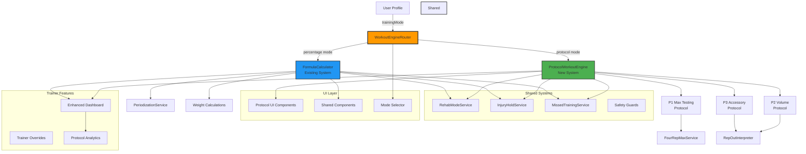
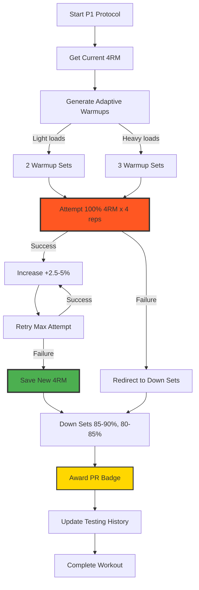
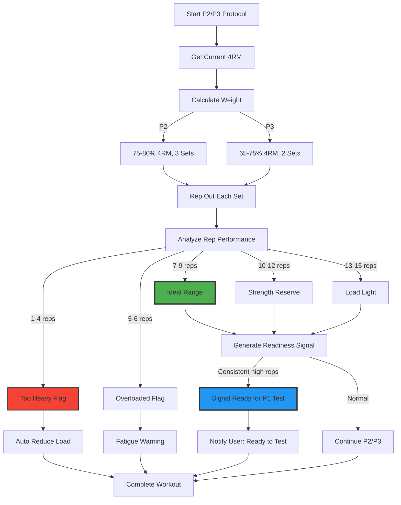

# Protocol System Implementation Plan
## Fitness Results App - PRD Integration

**Version:** 1.0  
**Strategy:** Parallel Systems (Percentage + Protocol modes coexist)  
**Status:** Ready for Implementation

---

## Executive Summary

This plan implements the full PRD requirements for a protocol-based training system (P1: Max Testing, P2: Volume, P3: Accessory) while maintaining the existing percentage-based formula system. Users and trainers can choose which mode to use, allowing for gradual adoption and effectiveness comparison.

**Key Features Being Added:**
- ✅ 3-Protocol System (P1/P2/P3) with earned progression
- ✅ 4RM testing and tracking
- ✅ Rehab Mode with injury holds and detraining logic
- ✅ Rep-Out Interpretation Engine with readiness signals
- ✅ Trainer Dashboard with protocol-aware analytics
- ✅ Training mode selection (Percentage vs Protocol)
- ✅ Badge system for protocol-specific achievements

---

## System Architecture



---

## Protocol Flow Diagrams

### P1: Max Attempt Protocol Flow



### P2/P3: Rep-Out Protocol Flow



---

## Data Models

### New TypeScript Interfaces

```typescript
// Protocol System Types
export type Protocol = 'P1' | 'P2' | 'P3';
export type TrainingMode = 'percentage' | 'protocol';

export interface ProtocolExerciseTemplate {
  exerciseId: string;
  protocol: Protocol;
  protocolOrder: number;
  alternatives?: string[];
  notes?: string;
}

export interface ProtocolDefinition {
  protocol: Protocol;
  name: string;
  description: string;
  warmupStrategy: 'adaptive' | 'fixed';
  sets: ProtocolSet[];
  downSetsOnFailure: boolean;
}

export interface ProtocolSet {
  setNumber: number;
  percentageOf4RM: number;
  instruction: 'rep-out' | 'max-attempt' | 'controlled';
  minReps?: number;
  maxReps?: number;
  restSeconds: number;
}

// 4RM Tracking
export interface FourRepMax {
  id: string;
  userId: string;
  exerciseId: string;
  weight: number;
  dateAchieved: number;
  verified: boolean; // True only if earned via P1
  testingSessionId?: string;
}

export interface MaxTestingAttempt {
  id: string;
  userId: string;
  exerciseId: string;
  fourRepMax: number;
  attemptedWeight: number;
  repsCompleted: number;
  successful: boolean;
  timestamp: number;
  sessionId: string;
}

// Injury & Recovery Types
export interface InjuryReport {
  id: string;
  userId: string;
  muscleGroup: MuscleGroup;
  severity: 'mild' | 'moderate' | 'severe';
  description: string;
  reportedAt: number;
}

export interface InjuryHold {
  id: string;
  userId: string;
  muscleGroups: MuscleGroup[];
  movementPatterns: string[]; // e.g., 'push', 'pull', 'squat'
  startDate: number;
  endDate: number;
  active: boolean;
  reason: string;
}

export interface RehabSession {
  id: string;
  userId: string;
  exerciseId: string;
  preInjuryMax: number;
  currentWeight: number;
  loadReduction: number; // Percentage
  painLevel?: number; // 0-10 scale
  sessionId: string;
  timestamp: number;
}

export interface MissedWorkout {
  id: string;
  userId: string;
  scheduledDate: number;
  reason: 'injury' | 'no_gym_access' | 'time_constraints' | 'other';
  notes?: string;
  timestamp: number;
}

export interface DetrainingResponse {
  daysMissed: number;
  loadReductionPercentage: number;
  disableMaxTesting: boolean;
  recommendation: string;
}

// Rep-Out Interpretation
export interface RepBandAnalysis {
  reps: number;
  band: 'too_heavy' | 'overloaded' | 'ideal' | 'reserve' | 'light';
  meaning: string;
  actionRequired: boolean;
}

export interface ReadinessSignal {
  exerciseId: string;
  readyForP1: boolean;
  confidence: number; // 0-1
  reasoning: string[];
  recommendedP1Date?: number;
}

export interface SafetyGuard {
  type: 'rep_drop' | 'multiple_failures' | 'form_concern' | 'overtraining';
  severity: 'warning' | 'critical';
  message: string;
  actionTaken: string;
}

// Trainer Features
export interface TrainerOverride {
  id: string;
  trainerId: string;
  userId: string;
  exerciseId: string;
  overrideType: 'protocol_change' | 'force_rehab' | 'adjust_intensity' | 'exercise_swap';
  details: any;
  reason: string;
  timestamp: number;
}

export interface WorkoutFlag {
  id: string;
  userId: string;
  flagType: 'plateau' | 'risk' | 'fatigue' | 'injury_concern';
  severity: 'low' | 'medium' | 'high';
  message: string;
  generatedAt: number;
  acknowledged: boolean;
}

// User Profile Enhancement
export interface UserProfile {
  // ... existing fields
  trainingMode: TrainingMode;
  protocolPreferences?: {
    preferredP1Frequency: number; // weeks between P1 tests
    autoSuggestP1: boolean;
    showReadinessSignals: boolean;
  };
}
```

---

## Implementation Phases

### Phase 1: Foundation (Types & Data Models)
**Goal:** Establish type definitions and database schema

**Key Deliverables:**
- Protocol types added to [`app/src/types/index.ts`](app/src/types/index.ts:1)
- Training mode added to UserProfile
- Injury/recovery type definitions
- Rep-out interpretation types
- Trainer feature types
- Schema updates in [`app/src/models/schema.ts`](app/src/models/schema.ts:1)

**Dependencies:** None  
**Complexity:** Low

---

### Phase 2: Protocol Engine Core
**Goal:** Build the core protocol-based workout generation system

**Key Deliverables:**
- [`ProtocolDefinitions.ts`](app/src/services/ProtocolDefinitions.ts) - P1, P2, P3 specifications
- [`ProtocolWorkoutEngine.ts`](app/src/services/ProtocolWorkoutEngine.ts) - Main engine
- P1 max testing logic with success/failure paths
- P2 volume protocol (3 sets, rep-out)
- P3 accessory protocol (2 sets, rep-out)
- [`FourRepMaxService.ts`](app/src/services/FourRepMaxService.ts) - 4RM tracking
- Adaptive warmup generation

**Dependencies:** Phase 1  
**Complexity:** High

**Critical Implementation Notes:**
- P1 must strictly enforce "earned progression" - no auto increases
- Warmup sets must adapt: light loads = 2 sets, heavy loads = 3 sets
- Failed P1 attempts must auto-redirect to down sets
- Lower body exceptions: minimum 10 reps per warmup set

---

### Phase 3: Injury & Recovery Systems
**Goal:** Implement rehab mode, injury holds, and detraining logic

**Key Deliverables:**
- [`RehabModeService.ts`](app/src/services/RehabModeService.ts) - Load reduction, pain tracking
- Legal disclaimer system for rehab mode
- [`InjuryHoldService.ts`](app/src/services/InjuryHoldService.ts) - Pause muscle groups
- [`MissedTrainingService.ts`](app/src/services/MissedTrainingService.ts) - Detraining responses
- Load reduction algorithms by days missed
- Injury hold UI components

**Dependencies:** Phase 1  
**Complexity:** Medium

**Detraining Logic:**
```typescript
1-3 sessions missed: Resume normally
4-7 days: -5 to -10% load
8-21 days: -10 to -20% load, no max testing
22+ days: Restart in Rehab Mode at 50-60% pre-injury
```

---

### Phase 4: Rep-Out Interpretation & Safety
**Goal:** Analyze rep-out performance and generate readiness signals

**Key Deliverables:**
- [`RepOutInterpreterService.ts`](app/src/services/RepOutInterpreterService.ts)
- Rep band classification (too heavy, ideal, light)
- Readiness signal generation for P1 testing
- Safety guards (30% drop, multiple failures)
- P1 testing cooldown enforcement

**Dependencies:** Phase 2  
**Complexity:** Medium

**Rep Band Classification:**
```
1-4 reps: Too heavy (reduce load)
5-6 reps: Overloaded/fatigued (monitor)
7-9 reps: Ideal range ✓
10-12 reps: Strength reserve (ready for P1 soon)
13-15 reps: Load light but acceptable
```

---

### Phase 5: Trainer Dashboard & Controls
**Goal:** Give trainers visibility and control over protocol training

**Key Deliverables:**
- Enhanced trainer dashboard with protocol awareness
- Override capabilities (reorder, force rehab, assign alternatives)
- Injury/hold visibility panel
- Flag system (plateau, risk, fatigue)
- Deep-dive analytics (success rates, trends)
- Trainer notes system

**Dependencies:** Phases 2, 3, 4  
**Complexity:** Medium

---

### Phase 6: Workout Engine Router
**Goal:** Route workouts to appropriate system based on user mode

**Key Deliverables:**
- [`WorkoutEngineRouter.ts`](app/src/services/WorkoutEngineRouter.ts)
- Update [`WorkoutEngine.ts`](app/src/services/WorkoutEngine.ts:1) to use router
- Backward compatibility validation
- Migration utility for switching modes
- Split tracking for hybrid users

**Dependencies:** Phase 2  
**Complexity:** Medium

**Critical:** Existing users must continue working without any changes!

---

### Phase 7: Redux State Management
**Goal:** Manage protocol-specific state across the app

**Key Deliverables:**
- Update [`workoutSlice.ts`](app/src/store/slices/workoutSlice.ts:1) - Add protocol state
- New [`rehabSlice.ts`](app/src/store/slices/rehabSlice.ts) - Injury/rehab state
- Update [`userSlice.ts`](app/src/store/slices/userSlice.ts:1) - Training mode
- New [`protocolSlice.ts`](app/src/store/slices/protocolSlice.ts) - Protocol assignments
- State persistence

**Dependencies:** Phases 2, 3  
**Complexity:** Low-Medium

---

### Phase 8: Protocol-Specific UI Components
**Goal:** Build UI components for protocol system

**Key Deliverables:**
- [`ProtocolBadge.tsx`](app/src/components/workout/ProtocolBadge.tsx) - P1/P2/P3 badges
- [`MaxAttemptScreen.tsx`](app/src/screens/workout/MaxAttemptScreen.tsx) - P1 testing UI
- [`RepOutSetCard.tsx`](app/src/components/workout/RepOutSetCard.tsx) - Rep-out feedback
- [`WarmupProgressView.tsx`](app/src/components/workout/WarmupProgressView.tsx) - Warmup display
- [`RehabModeToggle.tsx`](app/src/components/workout/RehabModeToggle.tsx) - Rehab interface
- [`InjuryHoldManager.tsx`](app/src/components/workout/InjuryHoldManager.tsx) - Hold management
- [`MissedWorkoutDialog.tsx`](app/src/components/workout/MissedWorkoutDialog.tsx) - Cancellation

**Dependencies:** Phases 2, 3, 7  
**Complexity:** Medium-High

**UI Design Principles:**
- P1 badge: Red/Orange (testing)
- P2 badge: Blue (volume)
- P3 badge: Purple (accessory)
- Clear visual feedback for rep-out performance
- Celebratory animations for P1 successes

---

### Phase 9: Training Mode Selection UI
**Goal:** Allow users to choose and switch between modes

**Key Deliverables:**
- [`TrainingModeSelector.tsx`](app/src/components/workout/TrainingModeSelector.tsx)
- Mode comparison information panel
- Onboarding flow for new users
- In-app mode switcher in settings
- Mode migration wizard

**Dependencies:** Phase 6, 7  
**Complexity:** Medium

---

### Phase 10: Badge & Reward Integration
**Goal:** Gamify the protocol system with achievements

**Key Deliverables:**
- Protocol-specific badges (P1 PR, rehab completed, etc.)
- Update [`GamificationService.ts`](app/src/services/GamificationService.ts:1) for protocol XP
- Visual celebrations for P1 successes
- Milestone tracking

**Dependencies:** Phase 2, 8  
**Complexity:** Low-Medium

---

### Phase 11: Analytics & Reporting
**Goal:** Track effectiveness and user preferences

**Key Deliverables:**
- [`ProtocolAnalyticsService.ts`](app/src/services/ProtocolAnalyticsService.ts)
- Comparison reports (percentage vs protocol)
- A/B testing framework
- Trainer monthly reports
- Data export functionality

**Dependencies:** Phases 2-10  
**Complexity:** Medium

---

### Phase 12: Testing & QA
**Goal:** Ensure system reliability and correctness

**Key Deliverables:**
- Unit tests for all new services
- Integration tests for mode switching
- E2E test suite for both modes
- Performance testing
- Edge case validation

**Dependencies:** All previous phases  
**Complexity:** High

---

### Phase 13: Documentation
**Goal:** Create comprehensive documentation for all stakeholders

**Key Deliverables:**
- Developer architecture documentation
- User guide for protocol system
- Trainer documentation
- Migration guide
- Troubleshooting guide

**Dependencies:** All previous phases  
**Complexity:** Low-Medium

---

### Phase 14: Rollout & Monitoring
**Goal:** Deploy safely and monitor performance

**Key Deliverables:**
- Staging deployment
- Feature flag implementation
- Error monitoring
- User feedback collection
- Data-driven optimization
- Production rollout plan

**Dependencies:** Phases 12, 13  
**Complexity:** Medium

---

## Key Implementation Decisions

### 1. Protocol Assignment Strategy
**Decision:** Exercises are assigned protocols in the workout template  
**Rationale:** Provides flexibility, allows trainers to customize

```typescript
// Example workout day with protocol assignments
const day: Day = {
  exercises: [
    { exerciseId: 'bench-press', protocol: 'P1' },
    { exerciseId: 'incline-press', protocol: 'P2' },
    { exerciseId: 'chest-fly', protocol: 'P3' },
  ]
};
```

### 2. 4RM vs 1RM
**Decision:** Use 4RM as the foundation  
**Rationale:** 
- Safer for testing (4 reps vs 1 max rep)
- More repeatable and consistent
- Better for hypertrophy-focused training
- Aligns with PRD specifications

### 3. Auto-Progression Lock
**Decision:** Rep-outs in P2/P3 do NOT auto-increase 4RM  
**Rationale:**
- Maintains "earned progression" philosophy
- Prevents over-training
- Makes P1 testing meaningful
- Builds psychological engagement

### 4. Rehab Mode Defaults
**Decision:** Rehab mode reduces load first, reps stay 10-15  
**Rationale:**
- Safer load progression
- Maintains movement patterns
- Allows for gradual strength return
- Easier to track recovery

### 5. Trainer Override Philosophy
**Decision:** All trainer overrides are logged with reasons  
**Rationale:**
- Accountability and learning
- Data for future improvements
- Client transparency
- Training pattern analysis

---

## Risk Mitigation

### Risk 1: User Confusion Between Modes
**Mitigation:**
- Clear onboarding explaining both modes
- Visual differentiation (badges, colors)
- In-app tooltips and help
- Default mode based on user experience level

### Risk 2: Data Migration Issues
**Mitigation:**
- Comprehensive migration testing
- Rollback capability
- Gradual rollout with feature flags
- User data backup before migration

### Risk 3: Protocol System Complexity
**Mitigation:**
- Start with simple P1/P2/P3 implementation
- Iterate based on user feedback
- Provide "easy mode" with AI-suggested protocols
- Extensive user testing before full release

### Risk 4: Performance Regression
**Mitigation:**
- Performance benchmarking
- Lazy loading of protocol system
- Code splitting
- Regular performance audits

---

## Success Metrics

### User Engagement
- Protocol mode adoption rate
- P1 testing frequency
- Workout completion rate (protocol vs percentage)
- User satisfaction scores

### Training Effectiveness
- PR frequency in protocol mode
- Injury rate comparison
- Adherence rate (protocol vs percentage)
- Strength gains comparison

### Technical Performance
- App crash rate
- Mode switching success rate
- Load time impact
- Error rate by feature

---

## Next Steps

1. ✅ **Review this plan** - Confirm approach and phases
2. **Prioritize phases** - Decide which phases to tackle first
3. **Allocate resources** - Assign team members to phases
4. **Set timeline** - Establish milestones (without specific dates)
5. **Begin Phase 1** - Start with type definitions and data models

---

## Questions for Discussion

1. Should we build all 14 phases, or focus on a core MVP first?
2. Do you want trainer features (Phase 5) early or later?
3. Should protocol mode be available to all users, or premium only?
4. Do you want to test with a small group before full rollout?
5. Are there any PRD requirements you want to deprioritize?

---

**Ready to proceed?** Let me know if you'd like to:
- Modify any phases
- Add/remove features
- Prioritize differently
- Start implementation

This plan is designed to be flexible and iterative. We can adjust as we learn from each phase!
