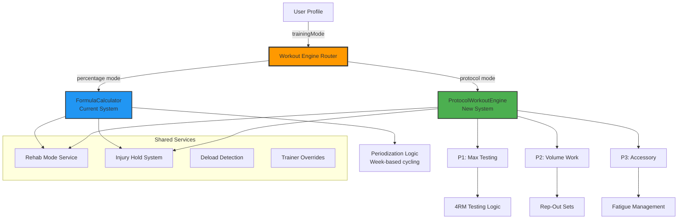

# Protocol System Integration Analysis

## Overview
This document analyzes the differences between your current formula-based system and the PRD's protocol-based system, helping inform the integration strategy.

---

## Current System vs Protocol System

### **Current System: Formula-Based Percentage Approach**

**How it works:**
```typescript
// Example: Calculate working weight
const workingWeight = userMax * WEEK_PERCENTAGES[weekType];
// Week 1 = 85%, Week 3 = 75%, etc.

// Sets are predefined in templates
sets: [
  { percentage: 40%, type: 'warmup' },
  { percentage: 85%, type: 'working' },
  { percentage: 85%, type: 'working' },
  { percentage: 65%, type: 'downset' }
]
```

**Characteristics:**
- ✅ **Percentage-driven**: All weights calculated from verified max
- ✅ **Week-based cycling**: Intensity/Volume/Mixed weeks (4-week blocks)
- ✅ **Template-based**: Exercise templates with predefined set structures
- ✅ **Progressive overload**: +5 lbs when user exceeds target reps
- ✅ **Rep ranges**: Fixed targets (e.g., 10-12 reps)
- ⚠️ **Max testing**: Happens during "Max Determination Week" only
- ⚠️ **Limited adaptability**: Changes require new templates

**Strengths:**
- Predictable progression
- Well-suited for periodization
- Easy to calculate
- Works well for intermediate/advanced lifters

**Limitations:**
- Doesn't capture "testing your limit" frequently
- No built-in protocol for earned progression
- Rep-out sets not emphasized
- Less coaching philosophy embedded in the system

---

### **PRD System: Protocol-Based Testing Approach**

**How it works:**
```typescript
// P1: Max Attempt Protocol - Test your 4RM
// User attempts 4 reps at 100% 4RM
// Success → +2.5-5% and retry
// Failure → down sets for volume
// New max only established when EARNED through P1

// P2: Volume Protocol (3 sets)
// 75-80% 4RM, rep out each set
// Signals readiness, doesn't auto-increase max

// P3: Accessory Protocol (2 sets)
// 65-75% 4RM, rep out
// Fatigue-managed work
```

**Characteristics:**
- ✅ **Protocol-first**: Exercise dictates which protocol it uses
- ✅ **Earned progression**: Max only increases through P1 testing
- ✅ **Rep-out emphasis**: P2/P3 use rep-to-failure for hypertrophy
- ✅ **4RM focus**: Based on 4-rep max, not 1RM
- ✅ **Adaptive warmups**: More warmup sets for heavier loads
- ✅ **Down sets always**: P1 failures redirect to volume work
- ✅ **Injury-aware**: Built-in Rehab Mode with load reduction
- ⚠️ **No auto-progression**: Rep-outs signal readiness, don't trigger increases
- ⚠️ **Testing required**: Must run P1 to establish new max

**Strengths:**
- Mimics real coaching (test when ready, earn your PRs)
- Clear progression path (P1 → success → new max)
- Psychologically engaging (testing feels like achievement)
- Flexibility without chaos (protocols provide structure)
- Injury-intelligent (Rehab Mode, holds, detraining logic)

**Limitations:**
- More complex to implement
- Requires careful scheduling of P1 weeks
- Users might test too often or not enough
- Need robust logic to prevent overtraining

---

## Key Philosophical Differences

| Aspect | Current System | Protocol System |
|--------|---------------|-----------------|
| **Progression** | Formula-based: Hit target → auto +5 lbs | Earned: Must test in P1 to increase max |
| **Max Updates** | After good performance in any week | Only during P1 Max Attempt Protocol |
| **Rep Targets** | Fixed ranges (10-12 reps) | Rep-out to failure (P2/P3) |
| **Max Type** | Uses estimated 1RM | Uses tested 4RM |
| **Testing** | Infrequent (max determination week) | Regular (P1 scheduled strategically) |
| **Workout Types** | Week-based (Intensity/Volume/Mixed) | Protocol-based (P1/P2/P3 assigned per exercise) |
| **Injury Handling** | Basic load reduction | Full Rehab Mode system with holds |
| **Progression Signal** | Rep performance → auto increase | Rep performance → ready for P1 test |

---

## Integration Options

### **Option 1: Full Replacement** ⚠️ **High Risk**
Replace formula system entirely with protocol system.

**Pros:**
- Clean architecture, one system
- Full coaching philosophy implementation
- Users get the "real" training experience

**Cons:**
- Breaks existing user data and expectations
- Requires complete rewrite of WorkoutEngine
- Loss of periodization features
- Migration path for existing users complex

**Recommendation:** ❌ **Not recommended** - Too disruptive

---

### **Option 2: Parallel Systems** 🎯 **Recommended**
Run both systems, let users/trainers choose.

```typescript
// User profile has training mode
interface UserProfile {
  trainingMode: 'percentage' | 'protocol';
  // ... existing fields
}

// WorkoutEngine routes to appropriate system
if (user.trainingMode === 'protocol') {
  return ProtocolWorkoutEngine.generateWorkout();
} else {
  return FormulaCalculator.calculateWeights();
}
```

**Pros:**
- Zero disruption to existing users
- Gradual rollout and testing
- Can compare effectiveness of both systems
- Trainers can choose per client
- Flexibility for different training philosophies

**Cons:**
- Maintains two systems (more code to maintain)
- Potential for feature divergence
- UI needs to support both modes

**Recommendation:** ✅ **Best approach** - Safe and flexible

---

### **Option 3: Hybrid System** 🔄 **Balanced**
Use protocols for main compound lifts, formulas for accessories.

```typescript
// Exercises tagged with appropriate system
interface Exercise {
  id: string;
  name: string;
  trainingSystem: 'protocol' | 'percentage';
  protocol?: 'P1' | 'P2' | 'P3'; // if protocol-based
}

// Big 4 lifts → Protocol system
// Bench Press: P1 (test 4RM)
// Squat: P1 (test 4RM)
// Deadlift: P1 (test 4RM)
// Overhead Press: P2 (volume work)

// Accessories → Formula system
// Bicep Curls: 75% of related max
// Lat Pulldown: 80% of Pull-up max
```

**Pros:**
- Best of both worlds
- Main lifts get "earned progression" experience
- Accessories remain predictable
- Easier to implement than full protocol system

**Cons:**
- Mixed mental model for users
- Complexity in workout planning
- Some features (like Rehab Mode) need to work across both

**Recommendation:** ⚙️ **Good compromise** - Worth considering

---

## Recommended Architecture: Parallel Systems



---

## Data Model Comparison

### **Current System**
```typescript
interface ExerciseTemplate {
  exerciseId: string;
  sets: SetTemplate[];
}

interface SetTemplate {
  setNumber: number;
  repRange: { min: number; max: number } | 'REP_OUT';
  weightFormula: {
    baseType: 'userMax' | 'bodyWeight';
    percentage?: number;
  };
  setType: 'warmup' | 'working' | 'downset';
}
```

### **Protocol System (New)**
```typescript
interface ProtocolExerciseTemplate {
  exerciseId: string;
  protocol: 'P1' | 'P2' | 'P3';
  protocolOrder: number; // P1 first, then P2, then P3
  alternatives?: string[]; // Exercise variants
}

interface ProtocolDefinition {
  protocol: 'P1' | 'P2' | 'P3';
  warmupLogic: 'adaptive' | 'fixed';
  sets: ProtocolSet[];
  downSetsOnFailure?: boolean; // P1 specific
}

interface ProtocolSet {
  setNumber: number;
  percentageOf4RM: number;
  instruction: 'rep-out' | 'max-attempt' | 'controlled';
  minReps?: number;
  maxReps?: number;
}
```

---

## Migration Strategy

### **Phase 1: Core Protocol Engine**
1. Create `ProtocolWorkoutEngine.ts` alongside `FormulaCalculator.ts`
2. Implement P1, P2, P3 protocol definitions
3. Build 4RM tracking and management
4. Create protocol-based set generation

### **Phase 2: User Choice & Routing**
1. Add `trainingMode` to UserProfile
2. Create router in WorkoutEngine to dispatch to appropriate system
3. Build UI toggle for users/trainers to switch modes
4. Ensure both systems work independently

### **Phase 3: Shared Systems**
1. Refactor Rehab Mode to work with both systems
2. Implement Injury Hold system (works across both)
3. Build Missed Training logic (detraining responses)
4. Create Trainer Dashboard with protocol awareness

### **Phase 4: Protocol-Specific Features**
1. Implement Rep-Out Interpretation Engine
2. Build P1 warmup adaptation logic
3. Create PR badge system for protocol users
4. Add down-set auto-redirect for failed P1 attempts

### **Phase 5: Testing & Rollout**
1. Test both systems in parallel
2. Gradual rollout to beta users
3. Collect feedback on protocol system
4. Optimize based on real usage

---

## Effort Estimation by Component

### **New Components Needed:**

1. **ProtocolWorkoutEngine** - NEW service
   - P1/P2/P3 protocol implementations
   - 4RM tracking and testing logic
   - Adaptive warmup generation
   - Down-set failure handling

2. **RehabModeService** - ENHANCE existing
   - Load reduction strategies
   - Pain check-in prompts
   - Pre-injury marker storage
   - Recovery milestone tracking

3. **InjuryHoldService** - NEW service
   - Muscle group pause system
   - Duration tracking
   - Auto-adjustment of workouts
   - Reintegration logic (rehab mode restart)

4. **MissedTrainingService** - NEW service
   - Workout cancellation tracking
   - Detraining response logic
   - Monthly summaries
   - Load reduction calculations

5. **RepOutInterpreter** - NEW service
   - Rep band analysis (1-4 too heavy, 7-9 ideal, etc.)
   - Readiness signals for P1 testing
   - Safety guards (30% drop → auto reduce)

6. **TrainerDashboard** - ENHANCE existing
   - Protocol-aware metrics
   - Override capabilities
   - Injury/hold visibility
   - Flag system (plateau, risk, fatigue)

### **Modified Components:**

1. **WorkoutEngine** - Add routing logic
2. **Types** - Add protocol-related interfaces
3. **Redux Store** - Add protocol state management
4. **UI Components** - Support both systems

---

## Recommendation

**Go with Option 2: Parallel Systems**

This provides:
- ✅ Safety: No disruption to existing users
- ✅ Flexibility: Users/trainers can choose
- ✅ Validation: Can test protocol system effectiveness
- ✅ Future-proof: Can deprecate old system if protocol proves superior
- ✅ Gradual rollout: Lower risk

The protocol system can be introduced as a "premium" or "advanced" training mode, with clear benefits explained to users who want more coaching-style progression.

---

## Next Steps

1. **Decision Point**: Choose integration approach
2. **Create detailed implementation plan** with todo list
3. **Design new type definitions** for protocol system
4. **Plan database schema changes** for 4RM tracking, injury holds, etc.
5. **Design UI/UX** for protocol-specific features
6. **Create testing strategy** for parallel systems
