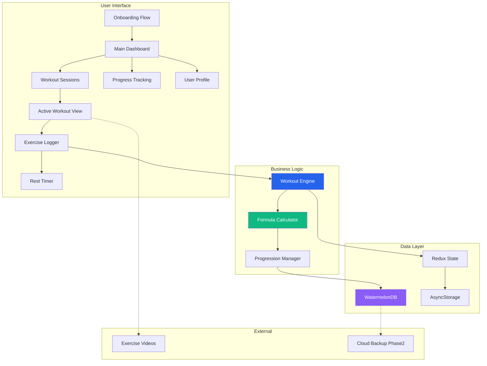
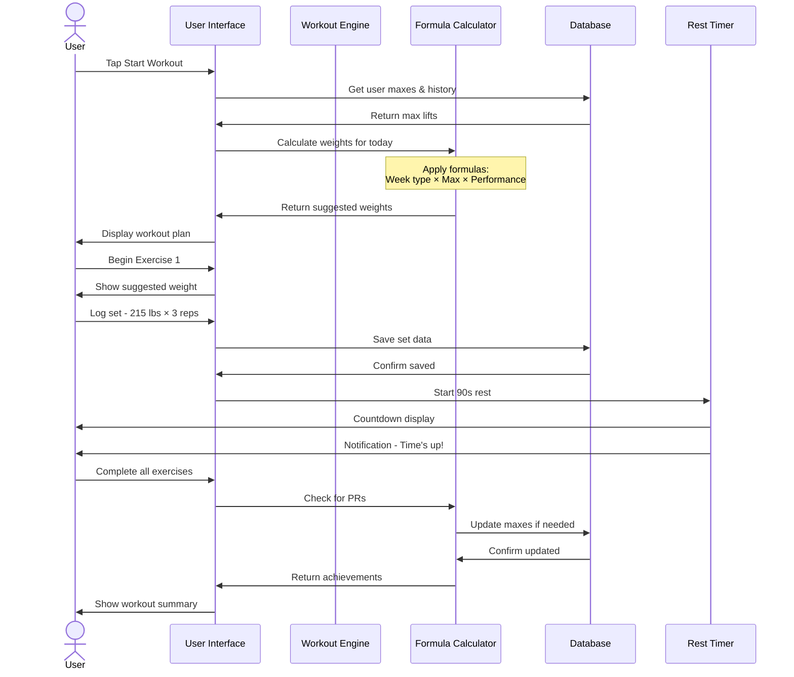
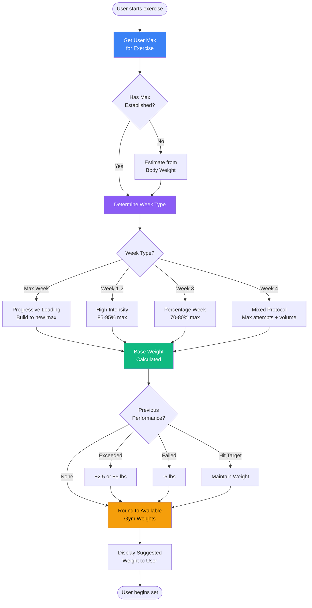
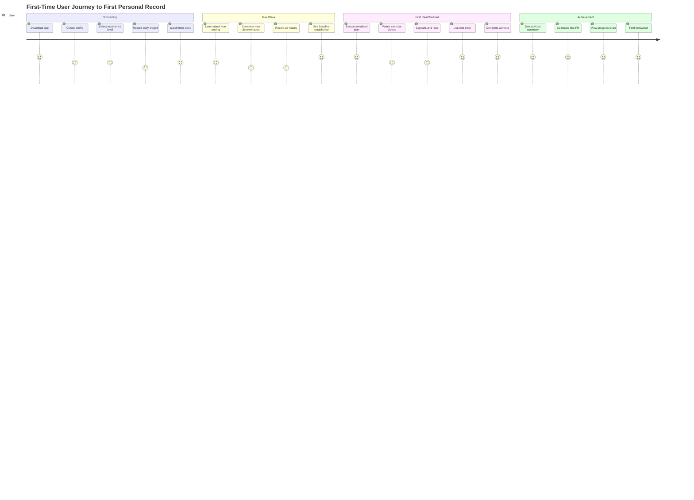
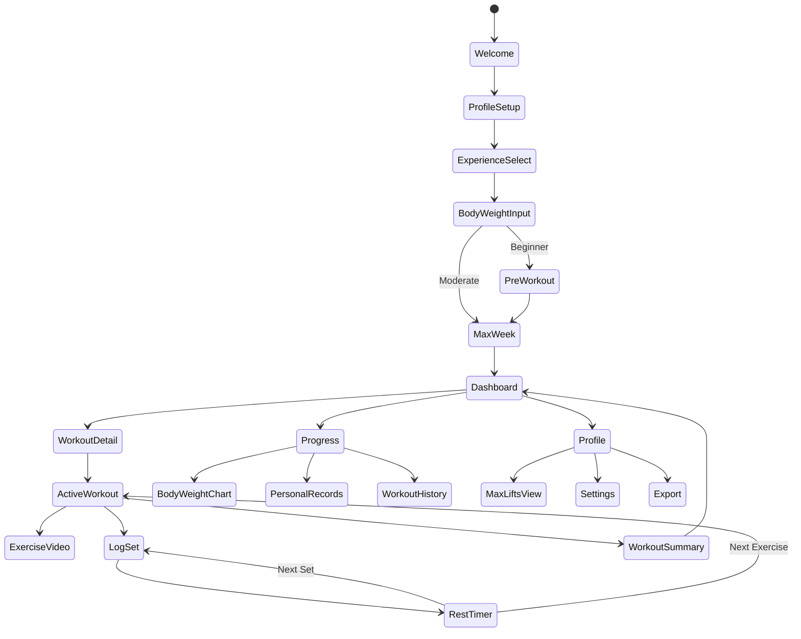
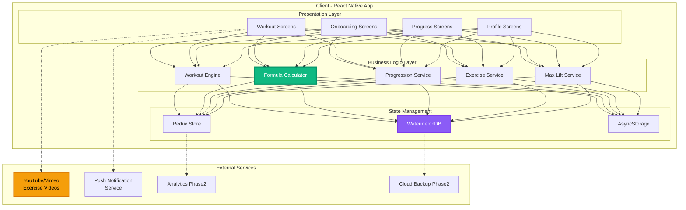

# My Mobile Trainer - Architecture Summary & Visual Overview

## 🎯 Project Vision

Transform the Excel-based "30 Minute Body" workout program into an intelligent, adaptive mobile fitness app that guides users through progressive strength training with formula-driven weight calculations.

---

## 📱 Technology Stack Decision

### **React Native + Expo + TypeScript**
```
┌─────────────────────────────────────────┐
│         React Native + Expo             │
│  ┌────────────┐  ┌──────────────────┐  │
│  │    iOS     │  │     Android      │  │
│  │  Native    │  │     Native       │  │
│  └────────────┘  └──────────────────┘  │
│                                         │
│  ┌─────────────────────────────────┐   │
│  │  Shared JavaScript/TypeScript   │   │
│  │  Business Logic & UI            │   │
│  └─────────────────────────────────┘   │
│                                         │
│  📦 WatermelonDB (Local Storage)        │
│  🎨 React Native Paper (UI Kit)         │
│  🧭 React Navigation (Routing)          │
│  📊 Victory Native (Charts)             │
└─────────────────────────────────────────┘
```

**Why This Stack?**
✅ Single codebase for both platforms (50% faster development)  
✅ Strong community and extensive libraries  
✅ Excellent performance for fitness apps  
✅ Easy video integration  
✅ Offline-first capability  

---

## 🏗️ System Architecture Overview



---

## 🔄 Core Data Flow

### How a Workout Session Works



---

## 🧮 Formula Engine Architecture

### Weight Calculation Logic Visualized



---

## 📊 Data Model Visualization

### Entity Relationships

```mermaid
erDiagram
    USER ||--o{ WORKOUT_SESSION : completes
    USER ||--|| USER_PROFILE : has
    USER ||--o{ BODY_WEIGHT : tracks
    USER ||--o{ MAX_LIFT : achieves
    
    WORKOUT_SESSION ||--|{ EXERCISE_LOG : contains
    EXERCISE_LOG ||--|{ SET_LOG : includes
    EXERCISE_LOG }o--|| EXERCISE : references
    
    WORKOUT_PROGRAM ||--|{ WEEK : organizes
    WEEK ||--|{ DAY : contains
    DAY ||--|{ EXERCISE_TEMPLATE : specifies
    
    EXERCISE ||--o{ EXERCISE_VARIANT : has_alternate
    
    USER {
        id PK
        name string
        experience_level enum
        created_at timestamp
    }
    
    WORKOUT_SESSION {
        id PK
        user_id FK
        week_num int
        day_num int
        started_at timestamp
        completed_at timestamp
        status enum
    }
    
    EXERCISE_LOG {
        id PK
        session_id FK
        exercise_id FK
        suggested_weight decimal
    }
    
    SET_LOG {
        id PK
        exercise_log_id FK
        set_number int
        weight decimal
        reps int
        completed_at timestamp
    }
    
    MAX_LIFT {
        id PK
        user_id FK
        exercise_id FK
        weight decimal
        verified boolean
        achieved_at timestamp
    }
```

---

## 🎨 App Visual Identity

### Design System at a Glance

```
┌─────────────────────────────────────────┐
│  COLOR PALETTE                          │
├─────────────────────────────────────────┤
│  ■ #2563EB  Energy Blue (Primary)       │
│  ■ #10B981  Success Green (Progress)    │
│  ■ #8B5CF6  Motivation Purple (PRs)     │
│  ■ #F59E0B  Warning Orange (Alerts)     │
│  ■ #1F2937  Dark Gray (Text)            │
│  ■ #F3F4F6  Light Gray (Backgrounds)    │
└─────────────────────────────────────────┘

┌─────────────────────────────────────────┐
│  TYPOGRAPHY                             │
├─────────────────────────────────────────┤
│  Headers:    Bold 24-32px               │
│  Body:       Regular 16px               │
│  Small:      Regular 14px               │
│  In-Workout: Bold 18px (easy to read)   │
│  Timer:      Bold 48px (high visibility)│
└─────────────────────────────────────────┘

┌─────────────────────────────────────────┐
│  COMPONENTS                             │
├─────────────────────────────────────────┤
│  Buttons:    Rounded 8px, 56px height   │
│  Cards:      Rounded 12px, shadow sm    │
│  Inputs:     Rounded 8px, 48px height   │
│  Icons:      24px (standard), 32px (key)│
└─────────────────────────────────────────┘
```

---

## 🚀 User Journey Visualization

### Complete User Flow from Download to First PR



---

## 📐 Application Structure Map

### File Organization

```
my-mobile-trainer/
│
├── 📱 APP LAYER
│   ├── src/screens/          ← All screen components
│   ├── src/navigation/       ← Navigation config
│   └── src/components/       ← Reusable UI
│
├── 🧠 BUSINESS LOGIC LAYER
│   ├── src/services/         ← Core algorithms
│   │   ├── WorkoutEngine.ts      (🔵 CRITICAL)
│   │   ├── FormulaCalculator.ts  (🔵 CRITICAL)
│   │   └── ProgressionService.ts (🔵 CRITICAL)
│   └── src/utils/            ← Helper functions
│
├── 💾 DATA LAYER
│   ├── src/models/           ← DB models (WatermelonDB)
│   ├── src/store/            ← Redux state management
│   └── src/constants/        ← Workout program data
│
└── 🧪 TESTING LAYER
    ├── __tests__/            ← Unit & integration tests
    └── e2e/                  ← E2E tests (Detox)
```

---

## 🔑 Critical Features - Priority Matrix

```
┌──────────────────────────────────────────┐
│  MUST HAVE (MVP Core)                    │
├──────────────────────────────────────────┤
│  ✅ User profile & experience selection  │
│  ✅ Body weight tracking                 │
│  ✅ Max determination workflow           │
│  ✅ Formula-driven weight calculator     │
│  ✅ Week 1-4 workout programs            │
│  ✅ Set/rep/weight logging               │
│  ✅ Rest timer with notifications        │
│  ✅ Progress tracking & PRs              │
│  ✅ Exercise library with instructions   │
│  ✅ Local data persistence               │
└──────────────────────────────────────────┘

┌──────────────────────────────────────────┐
│  SHOULD HAVE (Enhanced MVP)              │
├──────────────────────────────────────────┤
│  🎯 Embedded exercise videos             │
│  🎯 Alternative exercise selection       │
│  🎯 Body weight graphs/charts            │
│  🎯 Workout history view                 │
│  🎯 Dark mode support                    │
└──────────────────────────────────────────┘

┌──────────────────────────────────────────┐
│  NICE TO HAVE (Post-MVP)                 │
├──────────────────────────────────────────┤
│  💡 Achievement badges                   │
│  💡 Custom workout notes                 │
│  💡 Export to CSV/PDF                    │
│  💡 Workout reminders                    │
└──────────────────────────────────────────┘

┌──────────────────────────────────────────┐
│  FUTURE (Phase 2+)                       │
├──────────────────────────────────────────┤
│  🚀 Cloud sync & backup                  │
│  🚀 User authentication                  │
│  🚀 Cross-device support                 │
│  🚀 Social features                      │
│  🚀 Custom program creation              │
└──────────────────────────────────────────┘
```

---

## 🧮 Formula Logic Examples

### Key Calculations from Excel

#### 1. Week 1 Intensity Training
```javascript
// Set 1: Warmup (40% of max)
suggestedWeight = userMax * 0.40  // 6 reps

// Set 2: Build (85% of max)
suggestedWeight = userMax * 0.85  // 1 rep

// Set 3: Working (90% of max)
suggestedWeight = userMax * 0.90  // 1 rep

// Set 4: Max attempt (95% of max)
suggestedWeight = userMax * 0.95  // 1 rep or rep out

// Down Sets (60-70% of max)
suggestedWeight = userMax * 0.65  // rep out
```

#### 2. Progressive Overload Logic
```javascript
function calculateNextWeight(exercise, previousLog, userMax, weekType) {
  // Base calculation from week protocol
  let baseWeight = userMax * getWeekPercentage(weekType);
  
  if (previousLog) {
    const avgReps = calculateAverage(previousLog.sets.map(s => s.reps));
    const target = exercise.repRange;
    
    // Did user exceed target? Increase weight
    if (avgReps > target.max) {
      baseWeight += getIncrement(exercise.equipmentType);
    }
    
    // Did user fail target? Decrease weight
    if (avgReps < target.min) {
      baseWeight -= 5;
    }
    
    // Hit target perfectly? Maintain
  }
  
  return roundToGymWeights(baseWeight, 2.5); // Round to 2.5 lb increments
}
```

#### 3. Accessory Exercise Calculation
```javascript
// Exercises based on primary lift maxes
const chestFlyWeight = dbInclineMax * 0.25;
const lateralRaiseWeight = shoulderPressMax * 0.30;
const cableRowWeight = shoulderPressMax * 0.50;

// Examples from Excel:
// DB Chest Fly = DB Incline Max (75 lbs) * 0.25 = 18.75 lbs
// Lateral Raise = Shoulder Press Max (70 lbs) * 0.30 = 21 lbs
```

---

## 📱 Screen Flow Map



---

## 🎯 Week-by-Week Program Structure

### Training Phase Progression

```
┌─────────────────────────────────────────────────────┐
│  PROGRAM STRUCTURE                                  │
├─────────────────────────────────────────────────────┤
│                                                     │
│  Phase 0: PRE-WORKOUT (Beginners Only)              │
│  ├─ Pre-Workout 1: Very light weights, 3 days      │
│  └─ Pre-Workout 2: Light weights, introduction     │
│                                                     │
│  Phase 1: MAX DETERMINATION WEEK                    │
│  ├─ Day 1: Chest & Back maxes                      │
│  ├─ Day 2: Leg maxes                               │
│  └─ Day 3: Shoulder & Arm maxes                    │
│      Purpose: Establish baseline for formulas      │
│                                                     │
│  Phase 2: PROGRESSIVE TRAINING                      │
│  ├─ Week 1: High intensity (85-95% max)            │
│  │   Focus: Max strength, low reps                 │
│  │                                                  │
│  ├─ Week 2: Continued intensity + new PRs          │
│  │   Focus: Push for new maxes                     │
│  │                                                  │
│  ├─ Week 3: Percentage week (70-80% max)           │
│  │   Focus: Volume, hypertrophy                    │
│  │                                                  │
│  ├─ Week 4: Mixed protocol                         │
│  │   Focus: New max attempts + volume work         │
│  │                                                  │
│  └─ Repeat cycle with progressive overload         │
│                                                     │
│  Each Week = 3 Workout Days:                        │
│    • Day 1: Chest & Back                           │
│    • Day 2: Legs                                   │
│    • Day 3: Shoulders & Arms                       │
│                                                     │
└─────────────────────────────────────────────────────┘
```

---

## 💪 Exercise Organization

### Exercise Database Structure

```
CHEST EXERCISES
├─ Primary: Bench Press (Barbell)
├─ Alternate 1: Machine Press
├─ Alternate 2: Dumbbell Incline Press
└─ Accessory: Dumbbell/Machine Chest Fly

BACK EXERCISES
├─ Primary: Lat Pull Down
├─ Row Variations:
│  ├─ Machine Low Row
│  └─ Machine High Row
└─ Cable High Pulley Row

LEG EXERCISES
├─ Primary: Leg Press
├─ Quad: Leg Extension
├─ Hamstring: Leg Curl / Prone Leg Curl (alternate)
├─ Advanced: Machine Squat
└─ Bodyweight: Sissy Squats

SHOULDER EXERCISES
├─ Primary: Dumbbell Shoulder Press
├─ Alternate: Machine Shoulder Press
├─ Accessory:
│  ├─ Dumbbell Side Lateral Raise
│  ├─ Dumbbell/Machine Rear Delt Fly
│  └─ Shoulder Cleans

ARM EXERCISES
├─ Biceps:
│  ├─ Cable Bicep Curl
│  ├─ EZ Bar Curl (alternate)
│  └─ Alternating Dumbbell Curls
└─ Triceps:
   ├─ Straight Bar Pushdown
   └─ Overhead Rope Extension
```

---

## 📈 Progress Tracking Visual

### What Gets Tracked

```
┌─────────────────────────────────────────────┐
│  PROGRESS METRICS                           │
├─────────────────────────────────────────────┤
│                                             │
│  📊 Strength Progress                       │
│  ├─ Max lifts by exercise                  │
│  ├─ Historical max progression             │
│  ├─ Volume per workout (total lbs lifted)  │
│  └─ Personal records timeline              │
│                                             │
│  ⚖️ Body Composition                        │
│  ├─ Body weight over time                  │
│  ├─ Week-by-week comparison                │
│  └─ Trend analysis                         │
│                                             │
│  🏋️ Workout Consistency                     │
│  ├─ Workouts completed                     │
│  ├─ Current streak                         │
│  ├─ Workout frequency                      │
│  └─ Week completion rate                   │
│                                             │
│  💯 Performance Analytics                   │
│  ├─ Average reps per exercise              │
│  ├─ Weight progression rate                │
│  ├─ Recovery trends                        │
│  └─ Best performing exercises              │
│                                             │
└─────────────────────────────────────────────┘
```

### Example Progress Chart
```
Bench Press Progress Over 12 Weeks

270 lbs ┤                         ●
260 lbs ┤                    ●
250 lbs ┤              ●  ●
240 lbs ┤         ●
230 lbs ┤    ●
220 lbs ┤ ●
        └─────────────────────────────
         W1  W2  W3  W4  W5  W6  W7  W8

Starting Max: 225 lbs
Current Max:  270 lbs
Gain:         +45 lbs (20% increase)
```

---

## ⚡ Performance Optimization Strategy

### Load Time Optimization

```
App Launch → Dashboard
Target: < 2 seconds

┌─────────────────────────────────┐
│  Load Sequence:                 │
├─────────────────────────────────┤
│  1. Show splash (0ms)           │
│  2. Initialize DB (100ms)       │
│  3. Load user profile (50ms)    │
│  4. Render dashboard (200ms)    │
│  5. Lazy load week data (bg)    │
│  6. Prefetch today's workout    │
└─────────────────────────────────┘

Optimization Techniques:
✓ Lazy load workout weeks
✓ Memoize formula calculations
✓ Cache exercise library
✓ Virtual lists for long scrolls
✓ Image optimization
✓ Code splitting by route
```

---

## 🔐 Data Privacy & Security

### Privacy-First Architecture

```
┌─────────────────────────────────────────┐
│  LOCAL-FIRST APPROACH                   │
├─────────────────────────────────────────┤
│  ✓ All data stored on device            │
│  ✓ No server required for core features │
│  ✓ User owns their data                 │
│  ✓ Optional cloud backup (Phase 2)      │
│  ✓ Encrypted local database option      │
│  ✓ Biometric app lock (optional)        │
│  ✓ No tracking without consent          │
│  ✓ Easy data export (CSV, PDF)          │
└─────────────────────────────────────────┘
```

---

## 🧪 Testing Strategy Overview

### Test Pyramid

```
        /\
       /  \        E2E Tests (Detox)
      /    \       ├─ Complete workout flow
     /──────\      ├─ Onboarding journey
    /        \     └─ Max determination
   /          \    
  /────────────\   Integration Tests
 /   UNIT        \  ├─ Redux state management
/     TESTS       \ ├─ Database operations
──────────────────  └─ Navigation flows
 Formula Calculator
 Weight progression      ← Most critical to test
 Max lift calculations     (Must match Excel 100%)
 Data transformations
```

### Critical Test Scenarios

```
✅ Formula Accuracy
   → Test all weight calculations match Excel exactly
   → Validate rounding logic
   → Test edge cases (no max, first workout, etc.)

✅ Progression Logic
   → User exceeds reps → weight increases correctly
   → User fails reps → weight decreases correctly
   → Max lift updates when beaten

✅ Data Persistence
   → Workout survives app closure
   → Resume in-progress workout
   → Data integrity after updates

✅ User Flows
   → Beginner onboarding → Pre-workout → Max week → Week 1
   → Moderate onboarding → Max week → Week 1
   → Complete full workout session
   → View and understand progress
```

---

## 🎨 Visual Design Mockup Summary

### Key Screen Categories

```
ONBOARDING (4 screens)
┌──────┐  ┌──────┐  ┌──────┐  ┌──────┐
│Welcome│→│Profile│→│ Body │→│ Ready│
│      │  │ Setup│  │Weight│  │      │
└──────┘  └──────┘  └──────┘  └──────┘

MAIN TABS (3 primary)
┌──────────┐  ┌──────────┐  ┌──────────┐
│ 🏋️       │  │ 📊       │  │ 👤       │
│ Workout  │  │ Progress │  │ Profile  │
└──────────┘  └──────────┘  └──────────┘

WORKOUT FLOW (5 screens)
┌──────┐  ┌──────┐  ┌──────┐  ┌──────┐  ┌──────┐
│Detail│→│Active│→│Video │  │Timer │→│Summary│
│      │  │ Set  │  │Modal │  │      │  │      │
└──────┘  └──────┘  └──────┘  └──────┘  └──────┘

PROGRESS (4 screens)
┌──────┐  ┌──────┐  ┌──────┐  ┌──────┐
│Dash- │  │Body  │  │ PRs  │  │History│
│board │  │Weight│  │      │  │      │
└──────┘  └──────┘  └──────┘  └──────┘
```

---

## 🎬 Animation & Interaction Guide

### Micro-interactions

```
Set Logged Successfully
  ↓
┌─────────────┐
│      ✓      │  ← Checkmark appears
│   Logged!   │  ← Quick haptic feedback
└─────────────┘  ← Fade in/out (300ms)

New Personal Record
  ↓
┌──────────────────┐
│   🎉  🏆  🎉    │  ← Confetti animation
│  NEW RECORD!    │  ← Haptic celebration
│   255 lbs       │  ← Number count-up
└──────────────────┘  ← Scale in (500ms)

Rest Timer Complete
  ↓
Device vibrates 3 times
+
Push notification
+
Screen pulse effect
```

---

## 📦 Deliverables Summary

### Documentation Delivered

1. **[`my-mobile-trainer-architecture.md`](plans/my-mobile-trainer-architecture.md)**
   - Complete system architecture
   - Technology stack decisions
   - Data models and database schema
   - Formula implementation strategy
   - Development phases
   - Risk assessment
   - Future roadmap

2. **[`ui-mockups-visual-guide.md`](plans/ui-mockups-visual-guide.md)**
   - Screen-by-screen mockups (14 screens)
   - Interaction patterns
   - Animation specifications
   - Accessibility features
   - Dark mode design
   - Notification designs
   - Error states

3. **[`architecture-summary-visual.md`](plans/architecture-summary-visual.md)** (This Document)
   - Quick reference overview
   - Visual architecture diagrams
   - Formula examples
   - Priority matrix
   - Testing strategy

---

## 🚦 Implementation Roadmap

### Development Sequence

```
PHASE 1: FOUNDATION (Weeks 1-2)
├─ Project setup & configuration
├─ Data model & database
├─ Core services (Formula, Workout Engine)
└─ Basic navigation structure

PHASE 2: CORE WORKOUT (Weeks 3-5)
├─ Onboarding flow
├─ Max determination week UI
├─ Active workout interface
├─ Set logging & rest timer
└─ Workout completion flow

PHASE 3: PROGRESS & POLISH (Weeks 6-7)
├─ Progress dashboard & charts
├─ Personal records tracking
├─ Body weight graphing
├─ Settings & profile
└─ UI polish & animations

PHASE 4: ENHANCEMENT (Week 8)
├─ Video integration
├─ Alternative exercises
├─ Export functionality
├─ Performance optimization
└─ Testing & bug fixes

PHASE 5: RELEASE (Week 9-10)
├─ Beta testing
├─ App store submission
├─ Launch preparation
└─ User onboarding materials
```

---

## ✅ Definition of Done

### MVP Success Criteria

**Technical**:
- ✅ Formulas match Excel calculations 100%
- ✅ App works completely offline
- ✅ Zero data loss on app closure
- ✅ Loads in < 2 seconds
- ✅ Works on iOS 13+ and Android 8+
- ✅ < 100MB installed size
- ✅ Zero crashes during workouts

**User Experience**:
- ✅ User completes onboarding < 2 min
- ✅ User logs first workout successfully
- ✅ User understands weight suggestions
- ✅ User finds exercise videos easily
- ✅ User sees progress clearly
- ✅ User completes Week 1

**Business**:
- ✅ 70%+ workout completion rate
- ✅ 50%+ Week 1 completion
- ✅ 4+ star average rating
- ✅ < 40% Week 1 dropout

---

## 🎯 Key Architectural Decisions Recap

| Decision | Choice | Rationale |
|----------|--------|-----------|
| **Platform** | React Native + Expo | Cross-platform, rapid development, single codebase |
| **Language** | TypeScript | Type safety for complex formula logic |
| **Database** | WatermelonDB | Reactive, performant, offline-first |
| **State** | Redux Toolkit | Predictable state, time-travel debugging |
| **Navigation** | React Navigation | Industry standard, customizable |
| **UI Kit** | React Native Paper | Material Design, comprehensive components |
| **Charts** | Victory Native | Powerful, customizable, native performance |
| **Videos** | React Native Video | Supports streaming, local caching |
| **Storage** | Local-first, cloud Phase 2 | Privacy, offline capability, faster MVP |
| **Auth** | Not in MVP | Simplifies development, faster launch |

---

## 🔄 Formula-to-Code Translation Map

### Excel → TypeScript Examples

#### Excel Formula:
```excel
=IF(C23>12, E23+2.5, IF(C23<10, E23-5, E23))
```

#### TypeScript Implementation:
```typescript
function adjustWeight(
  repsCompleted: number,
  currentWeight: number,
  targetRange: { min: number; max: number }
): number {
  if (repsCompleted > targetRange.max) {
    return currentWeight + 2.5;
  } else if (repsCompleted < targetRange.min) {
    return currentWeight - 5;
  }
  return currentWeight;
}
```

#### Excel Formula:
```excel
=MAX_LIFT * 0.85
```

#### TypeScript Implementation:
```typescript
function calculateWorkingWeight(userMax: number, week: number): number {
  const percentage = getWeekPercentage(week);
  return roundToIncrement(userMax * percentage, 2.5);
}
```

---

## 🎥 Video Integration Plan

### Video Architecture

```
┌────────────────────────────────────────────┐
│  VIDEO STRATEGY                            │
├────────────────────────────────────────────┤
│                                            │
│  MVP: YouTube Embeds                       │
│  ├─ Free hosting                           │
│  ├─ Reliable streaming                     │
│  ├─ Mobile-optimized                       │
│  └─ Requires internet                      │
│                                            │
│  Phase 2: Vimeo or CDN                     │
│  ├─ Ad-free experience                     │
│  ├─ Offline caching                        │
│  ├─ Branded player                         │
│  └─ Better analytics                       │
│                                            │
│  Video Features:                           │
│  ├─ Inline preview thumbnails              │
│  ├─ Full-screen playback                   │
│  ├─ Playback speed control (0.5x - 1.5x)   │
│  ├─ Picture-in-picture while logging       │
│  └─ Download for offline (Phase 2)         │
│                                            │
└────────────────────────────────────────────┘
```

### Video URLs Structure
```json
{
  "exercises": [
    {
      "id": "bench-press",
      "name": "Bench Press",
      "videoUrl": "https://youtube.com/embed/xxxxx",
      "thumbnailUrl": "https://img.youtube.com/vi/xxxxx/maxresdefault.jpg",
      "duration": 130
    }
  ]
}
```

---

## 🎁 MVP Feature Set Final

### What Users Get in Version 1.0

```
✅ ONBOARDING
   • Profile creation
   • Experience level selection
   • Body weight tracking

✅ MAX WEEK
   • Progressive max testing
   • Safety guidelines
   • Max lift recording

✅ WORKOUT PROGRAM
   • Pre-workout phases (beginners)
   • Weeks 1-4 full programs
   • 3 days per week structure
   • 5-7 exercises per day

✅ INTELLIGENT SUGGESTIONS
   • Formula-based weight calculations
   • Performance-based adjustments
   • Alternative exercises
   • Rep range guidance

✅ DURING WORKOUT
   • Set-by-set logging
   • Automatic rest timer
   • Exercise videos
   • Form tips
   • Previous performance reference

✅ PROGRESS TRACKING
   • Personal records
   • Body weight trends
   • Workout history
   • Visual progress charts
   • Achievement celebrations

✅ SETTINGS
   • Unit preferences (lbs/kg)
   • Timer preferences
   • Notification controls
   • Dark mode
```

---

## 🚀 Getting Started

### Next Steps After Plan Approval

1. **Initialize Project**
   ```bash
   npx create-expo-app my-mobile-trainer --template expo-template-blank-typescript
   cd my-mobile-trainer
   ```

2. **Install Core Dependencies**
   ```bash
   npm install @reduxjs/toolkit react-redux
   npm install @react-navigation/native @react-navigation/stack @react-navigation/bottom-tabs
   npm install @nozbe/watermelondb
   npm install react-native-paper
   npm install victory-native
   ```

3. **Set Up Project Structure**
   ```bash
   mkdir -p src/{components,screens,services,models,store,utils,types,constants}
   mkdir -p src/components/{common,workout,charts,navigation}
   mkdir -p src/screens/{onboarding,workout,progress,profile}
   ```

4. **Begin Development**
   - Start with data models
   - Implement formula calculator
   - Build core services
   - Create UI components
   - Integrate everything

---

## 📋 Quick Reference: Excel to App Mapping

### Program Structure Mapping

| Excel Sheet | App Implementation |
|-------------|-------------------|
| Pre Workout 1 | `constants/preWorkout1.json` |
| Pre Workout 2 | `constants/preWorkout2.json` |
| Max Determination | `constants/maxWeek.json` |
| Week 1 Master | `constants/week1.json` |
| Week 2 Master | `constants/week2.json` |
| Week 3 Master | `constants/week3.json` |
| Week 4 Master | `constants/week4.json` |

### Formula Mapping

| Excel Column | TypeScript Function |
|--------------|-------------------|
| SUGGESTED WEIGHT | `calculateSuggestedWeight()` |
| CURRENT MAX | `getUserMax()` |
| REP LOG | `logSet()` |
| PREVIOUS | `getPreviousPerformance()` |
| Weight formulas | `FormulaCalculator.calculate()` |
| Week multipliers | `getWeekPercentage()` |
| Progressive overload | `applyProgressiveOverload()` |

---

## 🎓 Development Guidelines

### Code Quality Standards

```
✓ TypeScript strict mode enabled
✓ ESLint configured for React Native
✓ Prettier for consistent formatting
✓ Git hooks for pre-commit checks
✓ Component documentation required
✓ Test coverage > 80% for services
✓ PropTypes or TypeScript interfaces for all components
✓ Meaningful commit messages (Conventional Commits)
```

### Naming Conventions

```typescript
// Components: PascalCase
<WorkoutCard />

// Files: PascalCase for components, camelCase for utilities
WorkoutCard.tsx
formulaHelpers.ts

// Functions: camelCase
calculateSuggestedWeight()

// Constants: UPPER_SNAKE_CASE
const MAX_REST_TIME = 180;

// Types/Interfaces: PascalCase
interface WorkoutSession {}
type ExerciseType = 'dumbbell' | 'barbell' | 'machine';
```

---

## 💡 Key Insights from Excel Analysis

### Pattern Recognition

1. **Week Types Follow Pattern**: Max → Intensity → Percentage → Mixed (repeat)
2. **Rest Periods Scale**: Higher intensity = longer rest (30s → 120s)
3. **Rep Ranges Vary**: Strength (1-6), Hypertrophy (10-15), Endurance (15-30)
4. **Accessory Multipliers**: Consistent ratios to primary lifts
5. **Progressive Loading**: Small increments (2.5-5 lbs) prevent plateaus
6. **Down Sets**: Always 60-70% of max for volume work
7. **Rep Out Sets**: Build endurance without fixed target

### Formula Constants Identified

```typescript
const WEEK_PERCENTAGES = {
  max: 1.0,
  intensity: 0.85,
  percentage: 0.75,
  mixed: 0.90,
};

const ACCESSORY_RATIOS = {
  chestFly: 0.25,      // of incline press max
  lateralRaise: 0.30,   // of shoulder press max
  cableRow: 0.50,       // of shoulder press max
  rearDelt: 0.30,       // of shoulder press max
};

const WEIGHT_INCREMENTS = {
  dumbbell: 2.5,
  barbell: 5,
  machine: 5,
  cable: 5,
};

const REST_PERIODS = {
  warmup: 30,
  working: 90,
  max: 120,
  downset: 60,
  accessory: 60,
};
```

---

## 🎨 Visual Branding Elements

### App Aesthetic

```
DESIGN PHILOSOPHY: Clean, Motivational, Professional

Color Psychology:
• Blue (Primary): Trust, strength, reliability
• Green (Success): Growth, achievement, progress
• Purple (PRs): Excellence, celebration, premium
• Orange (Alerts): Energy, attention, caution

Typography Feel:
• Bold headers: Confident, strong
• Clear body text: Easy to read while exercising
• Large numbers: Quick scanning during workouts

Imagery Style:
• Clean illustrations over photos
• Minimal, not cluttered
• Motivational without being aggressive
• Professional trainer vibe
```

---

## 🔍 Competitor Analysis Inspiration

### Best Practices from Top Fitness Apps

**From Strong/StrongLifts**:
✓ Simple set logging interface
✓ Plate calculator
✓ Rest timer with notifications

**From Fitbod**:
✓ Intelligent workout adaptation
✓ Clear exercise videos
✓ Progress visualization

**From MyFitnessPal**:
✓ Easy onboarding
✓ Daily tracking habits
✓ Streak motivation

**Our Unique Value**:
🌟 Lance McCullough's proven program
🌟 Formula-driven personalization
🌟 Week-by-week structured progression
🌟 Built-in periodization
🌟 30-minute efficiency focus

---

## 🎯 Success Metrics Dashboard

### What We'll Track Post-Launch

```
┌──────────────────────────────────────┐
│  KEY PERFORMANCE INDICATORS          │
├──────────────────────────────────────┤
│                                      │
│  📱 Acquisition                      │
│     • Downloads per day              │
│     • Organic vs. paid               │
│     • App store conversion rate      │
│                                      │
│  🎯 Activation                       │
│     • Onboarding completion: >80%    │
│     • First workout started: >70%    │
│     • Max week completed: >60%       │
│                                      │
│  🔁 Retention                        │
│     • Day 1 return rate: >40%        │
│     • Week 1 completion: >50%        │
│     • Week 4 completion: >30%        │
│     • Monthly active users           │
│                                      │
│  💪 Engagement                       │
│     • Workouts per week: 3           │
│     • Session duration: 25-35 min    │
│     • Feature usage rates            │
│                                      │
│  ⭐ Quality                          │
│     • App store rating: 4.5+         │
│     • Crash-free rate: >99.5%        │
│     • Support tickets: Low           │
│                                      │
└──────────────────────────────────────┘
```

---

## 🎓 Technical Debt Prevention

### Build Quality In From Start

```
✅ Use TypeScript strictly (no any types)
✅ Write tests alongside features
✅ Document complex formula logic
✅ Keep components small and focused
✅ Avoid premature optimization
✅ Refactor as you learn
✅ Code review before merge (when team grows)
✅ Monitor bundle size
✅ Track technical debt in backlog
✅ Regular dependency updates
```

---

## 🌟 Unique Selling Points

### What Makes This App Special

```
┌────────────────────────────────────────────┐
│  1. PROVEN PROGRAM                         │
│     Based on Lance McCullough's expertise  │
│     100,000+ training sessions refined     │
│                                            │
│  2. INTELLIGENT ADAPTATION                 │
│     Formulas adjust to YOUR performance    │
│     Not generic templates                  │
│                                            │
│  3. EFFICIENT TRAINING                     │
│     30 minutes, 3x per week                │
│     No endless cardio required             │
│                                            │
│  4. PROGRESSIVE STRUCTURE                  │
│     Built-in periodization                 │
│     Automatic deload weeks                 │
│                                            │
│  5. BEGINNER FRIENDLY                      │
│     Pre-workout phases ease you in         │
│     Max testing done safely                │
│                                            │
│  6. PRIVACY FIRST                          │
│     Your data stays on your device         │
│     No account required to start           │
└────────────────────────────────────────────┘
```

---

## 🎨 Brand Identity Quick Reference

### Visual Language

```
Logo Concept:
┌─────────────────────┐
│  MY MOBILE TRAINER  │
│  ───────────────    │
│  💪 Smart Strength  │
│     Programming     │
└─────────────────────┘

Tagline Options:
• "Your AI-Powered Personal Trainer"
• "Smart Strength, Real Results"
• "30 Minutes to a Better You"
• "Proven Programming, Personal Progress"

App Store Category:
Primary: Health & Fitness
Secondary: Lifestyle

Target Audience:
• Age: 25-55
• Interest: Strength training, fitness
• Experience: Beginner to Intermediate
• Goal: Build strength efficiently
• Pain Point: Confusion about programming
```

---

## 📊 Final Architecture Diagram

### Complete System View



---

## 📖 Documentation Index

All planning documents are located in [`/plans`](./):

1. **[`my-mobile-trainer-architecture.md`](my-mobile-trainer-architecture.md)** - Complete technical architecture
2. **[`ui-mockups-visual-guide.md`](ui-mockups-visual-guide.md)** - Screen mockups and UI specifications  
3. **[`architecture-summary-visual.md`](architecture-summary-visual.md)** - This executive summary

Additionally available:
- [`trainingapp.xlsx`](../trainingapp.xlsx) - Original Excel program logic

---

## ✨ This Is What We're Building

**"My Mobile Trainer"** is more than a workout tracker. It's an intelligent training companion that:

- 🧠 **Thinks** using proven formulas from a champion trainer
- 📈 **Adapts** to your unique performance and progress
- 🎯 **Guides** you through structured, periodized programming
- 💪 **Motivates** with clear progress and achievements
- ⏱️ **Respects** your time with efficient 30-minute workouts
- 🔒 **Protects** your privacy with local-first architecture
- 🌟 **Delivers** real results through progressive overload

**The goal**: Make world-class strength programming accessible to everyone, in their pocket, adapting to them in real-time.

---

## 🎬 Ready to Build?

This architecture provides:
- ✅ Complete technical blueprint
- ✅ Visual mockups for all key screens
- ✅ Data model specifications
- ✅ Formula implementation guide
- ✅ Development roadmap
- ✅ Testing strategy
- ✅ Success criteria

Everything needed to build "My Mobile Trainer" from concept to app store.

---

**Next Action**: Review this plan, provide feedback, and we'll move into implementation! 🚀
