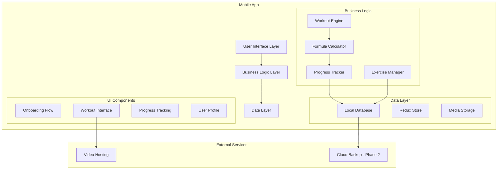
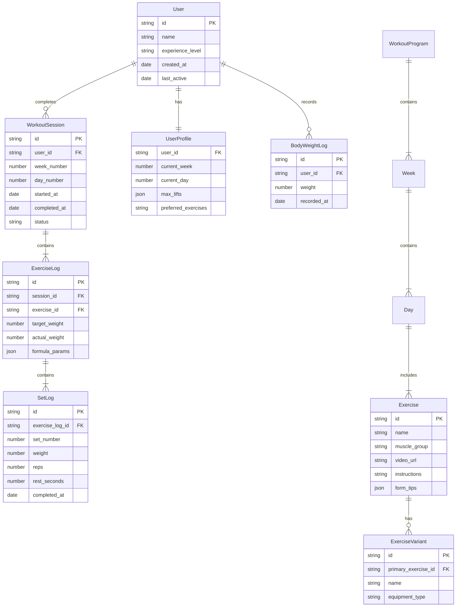
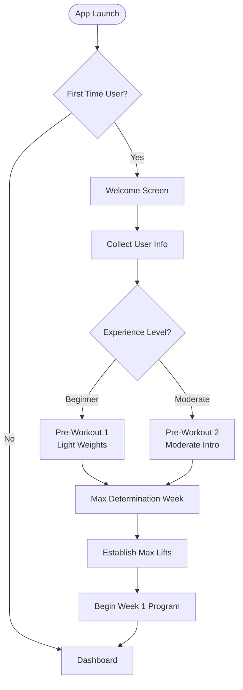
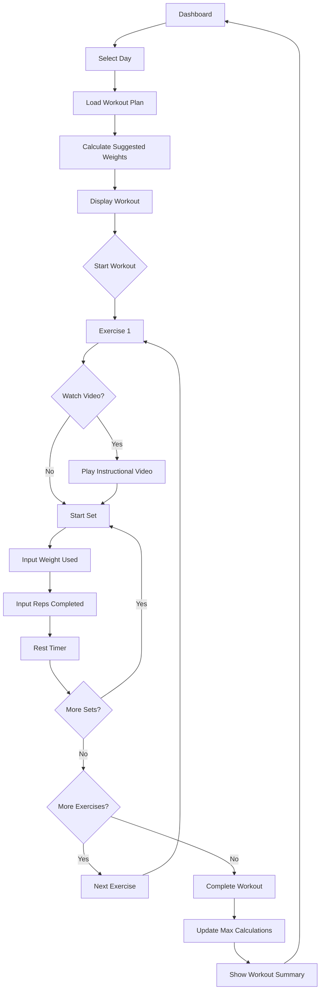
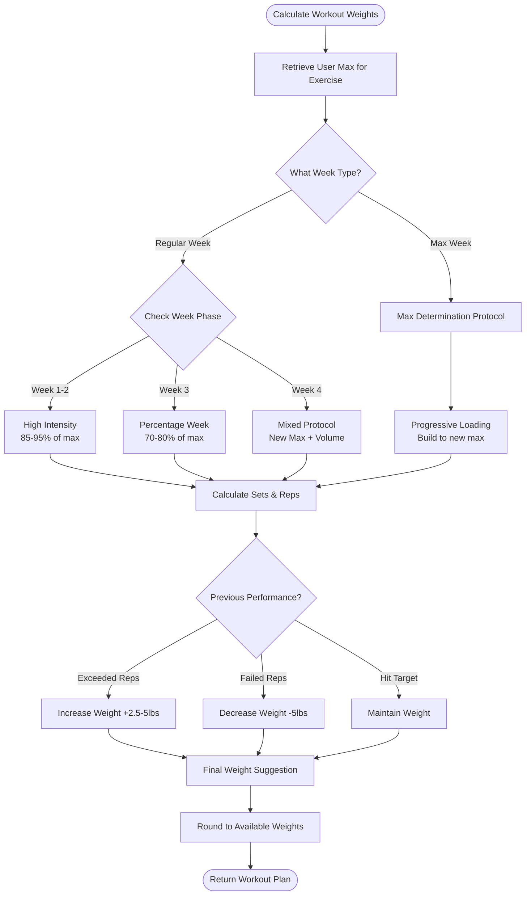
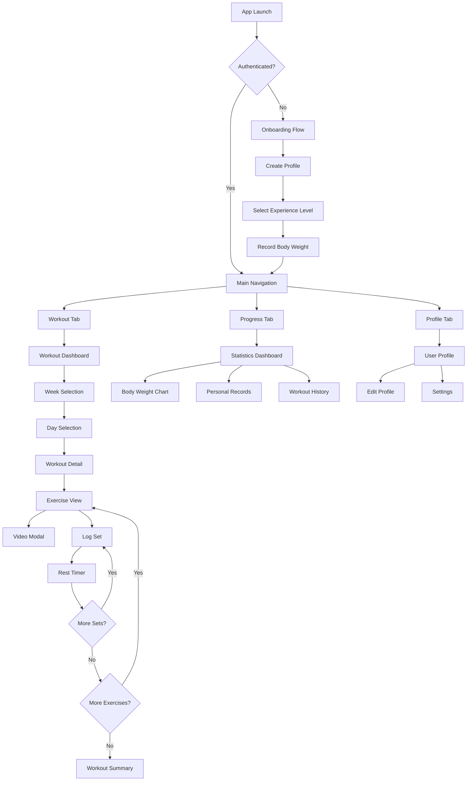
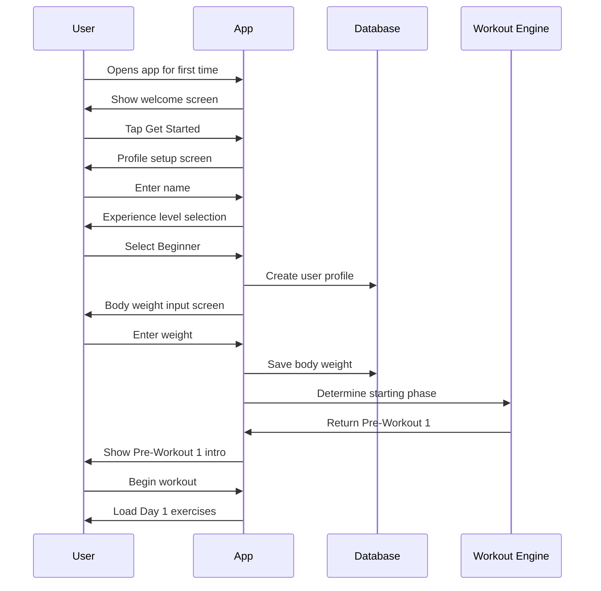
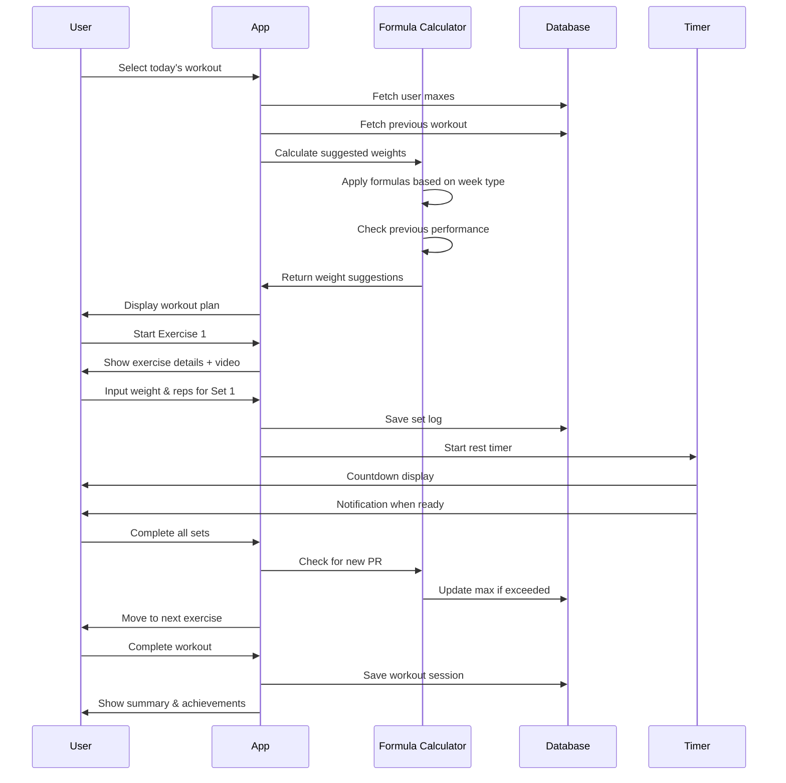

# My Mobile Trainer - Mobile App Architecture Plan

## Executive Summary

**My Mobile Trainer** is a progressive strength training mobile app based on Lance McCullough's "30 Minute Body" program. The app implements dynamic workout programming using formula-driven weight calculations that adapt to user performance over time.

### Key Differentiators
- **Adaptive Programming**: Weights automatically adjust based on previous performance
- **Structured Progression**: Multi-week program with distinct training phases
- **Intelligent Tracking**: Exercise history informs future workout recommendations
- **Alternative Exercises**: Equipment flexibility with alternate movements

---

## Technology Stack Recommendation

### Platform: React Native
**Rationale for MVP**:
- Single codebase for iOS and Android
- Large community and extensive libraries for fitness apps
- Native performance for smooth UX
- Easy integration with video playback
- Expo for rapid development and testing

### Core Technologies
- **Frontend**: React Native + TypeScript
- **State Management**: Redux Toolkit + RTK Query
- **Local Database**: WatermelonDB or Realm
- **UI Framework**: React Native Paper or NativeBase
- **Navigation**: React Navigation
- **Video Player**: React Native Video
- **Charts/Graphs**: Victory Native
- **Build Tool**: Expo (for MVP, eject later if needed)

### Cloud Services (Phase 2)
- **Backend**: Firebase or Supabase
- **Authentication**: Firebase Auth
- **Cloud Storage**: Firebase Firestore
- **Analytics**: Firebase Analytics + Mixpanel

---

## System Architecture

### High-Level Architecture Diagram



### Data Architecture



---

## Application Flow & User Journey

### User Onboarding Flow



### Workout Session Flow



### Weight Calculation Logic Flow



---

## Core Features & Modules

### 1. User Management Module
**Responsibilities**:
- User profile creation and management
- Experience level selection (Beginner/Moderate)
- Body weight tracking over time
- Personal records and max lifts storage

**Key Components**:
- `UserProfileService`
- `BodyWeightTracker`
- `MaxLiftManager`

### 2. Workout Engine Module
**Responsibilities**:
- Load weekly workout templates
- Apply formula-based weight calculations
- Handle workout progression logic
- Manage workout state during sessions

**Key Components**:
- `WorkoutProgramLoader`
- `FormulaEngine` - Core calculation logic
- `WorkoutSessionManager`
- `ProgressionAlgorithm`

**Formula Logic Examples** (from Excel):
```
Suggested Weight = UserMax * WeekMultiplier
Where WeekMultiplier varies:
- Week 1: 50-60% for warm-up sets, 85-95% for working sets
- Week 3: 70-80% for volume work
- Down Sets: 60-70% for rep-out sets

Weight Adjustment Logic:
IF previous_reps > target_range_max THEN
  next_weight = current_weight + 2.5 (dumbbells) or + 5 (machines)
ELSE IF previous_reps < target_range_min THEN
  next_weight = current_weight - 5
ELSE
  next_weight = current_weight
```

### 3. Exercise Library Module
**Responsibilities**:
- Store exercise database
- Manage exercise videos
- Handle alternate exercises
- Provide form tips and instructions

**Key Components**:
- `ExerciseRepository`
- `VideoPlayer`
- `ExerciseVariantManager`

### 4. Progress Tracking Module
**Responsibilities**:
- Log all sets, reps, and weights
- Calculate personal records
- Track workout completion
- Generate progress reports

**Key Components**:
- `SetLogger`
- `PRCalculator` (Personal Record Calculator)
- `ProgressAnalytics`
- `HistoryManager`

### 5. Timer & Notifications Module
**Responsibilities**:
- Rest period countdown
- Workout reminders
- Motivational notifications

**Key Components**:
- `RestTimer`
- `NotificationService`

---

## UI/UX Design Architecture

### Screen Hierarchy



### Key Screen Mockups (Text Description)

#### 1. Dashboard Screen
- Current week & day indicator
- Quick stats (workouts completed, current streak)
- Body weight quick log button
- Start workout CTA button
- Progress chart preview
- Weekly goals section

#### 2. Workout Detail Screen
- Week title and day (e.g., "Week 1 - Day 1: Chest & Back")
- Exercise list with expandable cards
- Each exercise shows:
  - Exercise name (clickable for video)
  - Suggested weight (calculated)
  - Sets table: Set # | Weight | Reps | Rest | Previous | Input
  - Alternative exercises indicator
- Tips section
- Complete workout button

#### 3. Active Exercise Screen
- Large exercise name
- Video player (embedded or full-screen)
- Current set indicator (Set 2 of 3)
- Weight input (with quick adjust +/- buttons)
- Reps input (with quick buttons)
- Rest timer (auto-starts after logging)
- Previous performance reference
- Form tips expandable panel

#### 4. Progress Screen
- Body weight graph over time
- Personal records by exercise
- Workout completion calendar
- Week-by-week comparison
- Volume tracking (total weight lifted)

---

## Data Model Deep Dive

### Core Entities

#### 1. Workout Program Structure
```typescript
interface WorkoutProgram {
  phases: {
    preWorkout1: WorkoutPhase;
    preWorkout2: WorkoutPhase;
    maxDetermination: WorkoutPhase;
    weeks: WorkoutPhase[];
  };
}

interface WorkoutPhase {
  id: string;
  name: string;
  description: string;
  weeks: Week[];
}

interface Week {
  weekNumber: number;
  title: string;
  goals: string;
  days: Day[];
  weekType: 'max' | 'intensity' | 'percentage' | 'mixed';
}

interface Day {
  dayNumber: number;
  name: string;
  muscleGroups: string[];
  exercises: Exercise[];
  warmup?: Exercise[];
  cooldown?: Exercise[];
}

interface Exercise {
  id: string;
  name: string;
  videoUrl: string;
  muscleGroup: string[];
  sets: SetTemplate[];
  alternates: ExerciseVariant[];
  formTips: string[];
  instructions: string;
}

interface SetTemplate {
  setNumber: number;
  repRange: { min: number; max: number } | 'REP OUT';
  restSeconds: number;
  weightFormula: WeightFormula;
  type: 'warmup' | 'working' | 'downset' | 'max';
}

interface WeightFormula {
  baseType: 'userMax' | 'previousMax' | 'bodyWeight' | 'fixed';
  exerciseReference?: string; // for exercises based on other exercise maxes
  percentage?: number; // percentage of max
  adjustment?: number; // fixed weight adjustment
  roundTo?: number; // round to nearest (2.5, 5, 10)
}
```

#### 2. User Progress Tracking
```typescript
interface UserProgress {
  userId: string;
  currentPhase: string;
  currentWeek: number;
  currentDay: number;
  maxLifts: Record<string, MaxLift>;
  bodyWeightHistory: BodyWeightEntry[];
  personalRecords: PersonalRecord[];
}

interface MaxLift {
  exerciseId: string;
  weight: number;
  reps: number;
  dateAchieved: Date;
  verified: boolean; // from max determination week
}

interface BodyWeightEntry {
  weight: number;
  date: Date;
  weekNumber: number;
}

interface WorkoutLog {
  id: string;
  userId: string;
  weekNumber: number;
  dayNumber: number;
  startedAt: Date;
  completedAt?: Date;
  exercises: ExerciseLog[];
  notes?: string;
}

interface ExerciseLog {
  exerciseId: string;
  suggestedWeight: number;
  sets: SetLog[];
}

interface SetLog {
  setNumber: number;
  weight: number;
  reps: number;
  restSeconds: number;
  completedAt: Date;
  perceivedEffort?: number; // RPE scale 1-10
}
```

---

## Formula Implementation Strategy

### Excel Formula Analysis

Based on the Excel sheets, here are the key formulas to implement:

#### 1. Initial Weight Suggestion (Week 1)
```
For Main Lifts (Bench, Squat, etc.):
- Set 1 (Warmup): Max * 0.40 (6 reps)
- Set 2 (Build): Max * 0.85 (1 rep)
- Set 3 (Max Attempt): Max * 0.90 (1 rep)
- Set 4 (Max Attempt): Max * 0.95 (1 rep or rep out)
- Down Sets: Max * 0.60-0.70 (rep out)

For Accessory Lifts:
- Based on percentage of related exercise max
- Example: Chest Fly = Incline Press Max * 0.25
- Example: Lateral Raise = Shoulder Press Max * 0.30
```

#### 2. Progressive Overload Logic
```javascript
function calculateNextWeight(exercise, previousLog, userMax, weekType) {
  const baseWeight = userMax * getWeekMultiplier(weekType);
  
  if (!previousLog) return roundToAvailable(baseWeight);
  
  const avgReps = calculateAverageReps(previousLog.sets);
  const targetRange = exercise.repRange;
  
  if (avgReps > targetRange.max) {
    // User exceeded target - increase weight
    return roundToAvailable(baseWeight + getIncrement(exercise.type));
  } else if (avgReps < targetRange.min) {
    // User failed target - decrease weight
    return roundToAvailable(baseWeight - 5);
  }
  
  return roundToAvailable(baseWeight);
}

function getWeekMultiplier(weekType) {
  switch(weekType) {
    case 'intensity': return 0.85; // Week 1-2
    case 'percentage': return 0.75; // Week 3
    case 'mixed': return 0.90; // Week 4
    case 'max': return 1.0; // Max determination
  }
}

function getIncrement(exerciseType) {
  // Dumbbells typically increase by 2.5-5 lbs
  // Machines/cables by 5-10 lbs
  // Barbells by 5-10 lbs
  return exerciseType === 'dumbbell' ? 2.5 : 5;
}
```

#### 3. Rep-Out Set Logic
```javascript
function handleRepOutSet(setLog, exercise) {
  // "Rep out" means maximum reps at given weight
  // Next workout uses this performance to adjust
  
  if (setLog.reps >= 20) {
    // Increase weight if getting 20+ reps
    return {
      nextWeight: setLog.weight + 5,
      recommendation: 'Great endurance! Increasing weight next time.'
    };
  } else if (setLog.reps < 10) {
    // Decrease if can't hit at least 10
    return {
      nextWeight: setLog.weight - 5,
      recommendation: 'Lower weight to build volume.'
    };
  }
  
  return {
    nextWeight: setLog.weight,
    recommendation: 'Keep building at this weight.'
  };
}
```

---

## Technical Implementation Details

### State Management Architecture

```typescript
// Redux Store Structure
interface RootState {
  user: UserState;
  workout: WorkoutState;
  progress: ProgressState;
  exercises: ExerciseState;
  ui: UIState;
}

interface WorkoutState {
  currentSession: WorkoutSession | null;
  activeExercise: number;
  activeSet: number;
  restTimerActive: boolean;
  restTimeRemaining: number;
}

interface ProgressState {
  maxLifts: Record<string, MaxLift>;
  recentWorkouts: WorkoutLog[];
  bodyWeights: BodyWeightEntry[];
  personalRecords: PersonalRecord[];
}
```

### Offline-First Strategy
1. **All data stored locally first** (WatermelonDB or Realm)
2. **Synchronization queue** for cloud backup (Phase 2)
3. **Optimistic updates** for immediate UI response
4. **Conflict resolution** based on timestamp
5. **Export functionality** to backup locally

---

## Component Architecture

### Screen Components

```
src/
├── screens/
│   ├── onboarding/
│   │   ├── WelcomeScreen.tsx
│   │   ├── ExperienceLevelScreen.tsx
│   │   ├── BodyWeightInputScreen.tsx
│   │   └── PreWorkoutIntroScreen.tsx
│   ├── workout/
│   │   ├── WorkoutDashboard.tsx
│   │   ├── WorkoutDetailScreen.tsx
│   │   ├── ActiveWorkoutScreen.tsx
│   │   ├── ExerciseVideoModal.tsx
│   │   └── WorkoutSummaryScreen.tsx
│   ├── progress/
│   │   ├── ProgressDashboard.tsx
│   │   ├── BodyWeightChartScreen.tsx
│   │   ├── PersonalRecordsScreen.tsx
│   │   └── WorkoutHistoryScreen.tsx
│   └── profile/
│       ├── ProfileScreen.tsx
│       ├── SettingsScreen.tsx
│       └── MaxLiftsScreen.tsx
```

### Shared Components

```
src/components/
├── workout/
│   ├── ExerciseCard.tsx
│   ├── SetInputRow.tsx
│   ├── RestTimer.tsx
│   ├── WeightSelector.tsx
│   └── ExerciseAlternateSelector.tsx
├── charts/
│   ├── BodyWeightChart.tsx
│   ├── VolumeChart.tsx
│   └── ProgressLine.tsx
├── common/
│   ├── Button.tsx
│   ├── Card.tsx
│   ├── Input.tsx
│   └── VideoPlayer.tsx
└── navigation/
    ├── TabNavigator.tsx
    └── StackNavigator.tsx
```

### Business Logic Services

```
src/services/
├── WorkoutEngine.ts        # Core workout logic
├── FormulaCalculator.ts    # Weight calculation formulas
├── ProgressionService.ts   # Week-to-week progression
├── MaxLiftService.ts       # Max lift tracking and calculation
├── ExerciseService.ts      # Exercise CRUD operations
└── SyncService.ts          # Cloud sync (Phase 2)
```

---

## MVP Feature Prioritization

### Phase 1: Core MVP (Local-Only)
✅ **Must Have**:
1. User profile creation with experience level
2. Body weight tracking
3. Max determination week workflow
4. Week 1-4 workout programs
5. Exercise library with instructions
6. Set/rep/weight logging during workouts
7. Rest timer
8. Weight calculation engine with formulas
9. Progress tracking (personal records, workout history)
10. Local data persistence

🎯 **Should Have**:
1. Embedded video player for exercise demos
2. Alternative exercise selection
3. Body weight graphs
4. Export workout data
5. Dark mode

💡 **Nice to Have**:
1. Workout reminder notifications
2. Achievement badges
3. Notes on exercises
4. Custom rest timer durations

### Phase 2: Enhanced Features
- Cloud backup and sync
- User authentication
- Cross-device synchronization
- Advanced analytics
- Social features (optional)
- Custom workout creation

---

## Detailed Feature Specifications

### Feature 1: Adaptive Weight Calculator

**Input**:
- User's current max for exercise
- Week number and type
- Previous workout performance
- Exercise type (dumbbell, barbell, machine)

**Process**:
1. Retrieve user's verified max for the exercise
2. Determine week protocol (intensity/percentage/mixed/max)
3. Apply percentage formula to calculate base weight
4. Check previous workout performance:
   - If exceeded rep range → increase weight
   - If failed rep range → decrease weight
   - If hit target → maintain weight
5. Round to gym's available weights (2.5, 5, 10 lb increments)

**Output**:
- Suggested weight for each set
- Explanation of why this weight (optional tooltip)
- Previous performance reference

**Edge Cases**:
- First time doing exercise (no previous data) → use max percentage
- Exercise alternate selected → use equivalent max from primary
- User overrides suggestion → track as custom weight
- Max not yet determined → use conservative estimate based on body weight

### Feature 2: Workout Session Manager

**Workout Lifecycle**:
1. **Pre-Workout**: 
   - Display weekly goals
   - Record body weight
   - Review planned exercises
   
2. **During Workout**:
   - Exercise-by-exercise flow
   - Quick video access
   - Set logging interface
   - Automatic rest timer
   - Progress indicator (Exercise 2 of 5)
   
3. **Post-Workout**:
   - Workout summary with totals
   - New PRs celebration
   - Max lift updates
   - Next workout preview

**Session State Management**:
- Pause/resume capability
- Auto-save progress
- Recovery from app closure
- Workout abandonment handling

### Feature 3: Max Determination Week

**Special Workflow**:
- Dedicated UI for max testing
- Progressive weight recommendations
- "Insert Final Max" input
- Safety guidelines prominent
- Form check reminders every set
- Extended rest periods (2 min default)

**Max Validation**:
- Sanity check against body weight
- Flag suspicious maxes for review
- Option to re-test specific exercises

---

## Database Schema Design

### Tables (WatermelonDB Collections)

```javascript
// schema.js
export const schema = {
  version: 1,
  tables: [
    {
      name: 'users',
      columns: [
        { name: 'name', type: 'string' },
        { name: 'experience_level', type: 'string' },
        { name: 'current_week', type: 'number' },
        { name: 'current_day', type: 'number' },
        { name: 'created_at', type: 'number' },
      ]
    },
    {
      name: 'body_weights',
      columns: [
        { name: 'user_id', type: 'string', isIndexed: true },
        { name: 'weight', type: 'number' },
        { name: 'week_number', type: 'number' },
        { name: 'recorded_at', type: 'number' },
      ]
    },
    {
      name: 'max_lifts',
      columns: [
        { name: 'user_id', type: 'string', isIndexed: true },
        { name: 'exercise_id', type: 'string', isIndexed: true },
        { name: 'weight', type: 'number' },
        { name: 'reps', type: 'number' },
        { name: 'verified', type: 'boolean' },
        { name: 'achieved_at', type: 'number' },
      ]
    },
    {
      name: 'workout_sessions',
      columns: [
        { name: 'user_id', type: 'string', isIndexed: true },
        { name: 'week_number', type: 'number', isIndexed: true },
        { name: 'day_number', type: 'number', isIndexed: true },
        { name: 'started_at', type: 'number' },
        { name: 'completed_at', type: 'number', isOptional: true },
        { name: 'status', type: 'string' }, // 'in_progress', 'completed', 'abandoned'
        { name: 'notes', type: 'string', isOptional: true },
      ]
    },
    {
      name: 'exercise_logs',
      columns: [
        { name: 'session_id', type: 'string', isIndexed: true },
        { name: 'exercise_id', type: 'string', isIndexed: true },
        { name: 'exercise_variant_id', type: 'string', isOptional: true },
        { name: 'suggested_weight', type: 'number' },
        { name: 'order', type: 'number' },
      ]
    },
    {
      name: 'set_logs',
      columns: [
        { name: 'exercise_log_id', type: 'string', isIndexed: true },
        { name: 'set_number', type: 'number' },
        { name: 'weight', type: 'number' },
        { name: 'reps', type: 'number' },
        { name: 'rest_seconds', type: 'number' },
        { name: 'completed_at', type: 'number' },
        { name: 'perceived_effort', type: 'number', isOptional: true },
      ]
    },
    {
      name: 'exercises',
      columns: [
        { name: 'name', type: 'string' },
        { name: 'muscle_groups', type: 'string' }, // JSON array
        { name: 'equipment_type', type: 'string' },
        { name: 'video_url', type: 'string' },
        { name: 'instructions', type: 'string' },
        { name: 'form_tips', type: 'string' }, // JSON array
      ]
    },
  ]
};
```

---

## Navigation Architecture

### Tab Navigation Structure
```
MainTabs
├── Workout (Stack)
│   ├── WorkoutDashboard
│   ├── WorkoutDetail
│   ├── ActiveWorkout
│   ├── VideoPlayer (Modal)
│   └── WorkoutSummary
├── Progress (Stack)
│   ├── ProgressDashboard
│   ├── BodyWeightHistory
│   ├── PersonalRecords
│   └── WorkoutHistory
└── Profile (Stack)
    ├── ProfileHome
    ├── EditProfile
    ├── MaxLifts
    └── Settings
```

---

## Performance Optimization Strategy

### Key Considerations
1. **Lazy Loading**: Load week data only when needed
2. **Memoization**: Cache calculated weights within session
3. **Virtual Lists**: For long exercise/history lists
4. **Image Optimization**: Compress and cache exercise images
5. **Video Streaming**: Use adaptive bitrate for exercise videos
6. **Database Indexing**: Index user_id, week_number, exercise_id
7. **Redux Selectors**: Memoized selectors with reselect

---

## Security & Data Privacy

### Local Data Protection
- Encrypt local database (SQLCipher for sensitive data)
- Biometric authentication option
- No tracking without consent
- GDPR/CCPA compliance ready

### Future Cloud Sync
- End-to-end encryption for synced data
- OAuth 2.0 authentication
- Data export in standard formats
- Right to deletion

---

## Testing Strategy

### Unit Testing
- Formula calculator functions
- Weight progression logic
- Max lift calculations
- Data model transformations

### Integration Testing
- Database operations
- Redux state management
- Navigation flows
- Timer functionality

### E2E Testing (Detox)
- Complete workout flow
- Onboarding process
- Max determination week
- Progress tracking

### User Testing Scenarios
1. Beginner completes first week
2. Moderate user establishes maxes
3. Week progression with weight increases
4. Alternate exercise selection
5. Workout pause and resume

---

## Development Phases

### Phase 1: Foundation (MVP Core)
1. Project setup (React Native + Expo)
2. Database schema and models
3. Core formula engine
4. Exercise library seed data
5. Basic UI components
6. Navigation structure

### Phase 2: Workout Experience
1. Onboarding flow
2. Max determination workflow
3. Workout detail screens
4. Active workout interface
5. Set logging functionality
6. Rest timer
7. Workout completion flow

### Phase 3: Progress & Polish
1. Progress dashboard
2. Charts and visualizations
3. Personal records tracking
4. Body weight graphing
5. Workout history
6. Settings and preferences

### Phase 4: Enhancement
1. Video integration
2. Alternative exercises
3. Notifications
4. Export functionality
5. Performance optimizations
6. Beta testing refinements

### Phase 5: Cloud Features (Post-MVP)
1. Backend setup (Firebase/Supabase)
2. Authentication
3. Cloud sync
4. Cross-device support
5. Analytics integration

---

## Risk Assessment & Mitigation

### Technical Risks

| Risk | Impact | Mitigation |
|------|--------|------------|
| Complex formula logic errors | High | Extensive unit tests, validation against Excel |
| Database performance issues | Medium | Proper indexing, query optimization |
| Video storage/bandwidth | Medium | CDN hosting, adaptive streaming |
| Device compatibility | Medium | Comprehensive device testing |
| App store approval delays | Low | Follow guidelines, prepare assets early |

### Product Risks

| Risk | Impact | Mitigation |
|------|--------|------------|
| User confusion with complex workouts | High | Clear onboarding, tooltips, video guides |
| User drops off after week 1 | High | Engagement features, push notifications |
| Max determination intimidating | Medium | Safety guidelines, confidence building |
| Gym equipment unavailable | Medium | Robust alternate exercise system |

---

## Accessibility Considerations

- **Large touch targets** for in-workout logging (sweaty fingers)
- **High contrast mode** for bright gym environments
- **Screen reader support** for visually impaired users
- **Haptic feedback** for timer completion
- **Voice input** for hands-free logging (future)
- **Landscape mode support** for video viewing

---

## Analytics & Metrics

### Key Metrics to Track (Post-MVP)
1. **Engagement**: 
   - Daily/weekly active users
   - Workout completion rate
   - Dropout point analysis
   
2. **Performance**:
   - Average session duration
   - Exercises per workout
   - Week completion rate
   
3. **Growth**:
   - User weight progression
   - Strength gains over time
   - Personal record frequency

---

## File Structure Proposal

```
my-mobile-trainer/
├── app/                          # Expo Router (if using Expo)
├── src/
│   ├── components/               # Reusable components
│   │   ├── common/
│   │   ├── workout/
│   │   ├── charts/
│   │   └── navigation/
│   ├── screens/                  # Screen components
│   │   ├── onboarding/
│   │   ├── workout/
│   │   ├── progress/
│   │   └── profile/
│   ├── services/                 # Business logic
│   │   ├── WorkoutEngine.ts
│   │   ├── FormulaCalculator.ts
│   │   ├── ProgressionService.ts
│   │   └── ExerciseService.ts
│   ├── models/                   # Database models
│   │   ├── schema.ts
│   │   ├── User.ts
│   │   ├── WorkoutSession.ts
│   │   └── Exercise.ts
│   ├── store/                    # Redux store
│   │   ├── slices/
│   │   ├── selectors/
│   │   └── store.ts
│   ├── utils/                    # Utilities
│   │   ├── formulaHelpers.ts
│   │   ├── dateHelpers.ts
│   │   └── validators.ts
│   ├── constants/                # Constants
│   │   ├── exercises.ts
│   │   ├── workoutProgram.ts
│   │   └── formulas.ts
│   ├── types/                    # TypeScript types
│   │   └── index.ts
│   └── assets/                   # Images, fonts, etc.
├── __tests__/                    # Test files
├── docs/                         # Documentation
├── package.json
└── app.json                      # Expo config
```

---

## Workout Program Data Structure

### JSON Configuration Format

```json
{
  "programId": "30-minute-body-v1",
  "programName": "30 Minute Body",
  "phases": [
    {
      "id": "pre-workout-1",
      "name": "Pre Workout 1",
      "description": "Laying the Foundation",
      "targetExperience": "beginner",
      "weeks": [
        {
          "weekNumber": 0,
          "title": "Laying the Foundation",
          "goals": "Get your body used to being in the gym...",
          "days": [
            {
              "dayNumber": 1,
              "name": "Chest & Back",
              "exercises": [
                {
                  "exerciseId": "dumbbell-incline-press",
                  "order": 1,
                  "sets": [
                    {
                      "setNumber": 1,
                      "repRange": {"min": 10, "max": 12},
                      "restSeconds": 60,
                      "weightFormula": {
                        "type": "fixed",
                        "value": 12.5
                      }
                    }
                  ]
                }
              ]
            }
          ]
        }
      ]
    },
    {
      "id": "max-determination",
      "name": "Max Determination Week",
      "description": "Establish baseline strength levels",
      "weeks": [...]
    },
    {
      "id": "progressive-weeks",
      "name": "Progressive Training",
      "weeks": [
        {
          "weekNumber": 1,
          "weekType": "intensity",
          "title": "Week 1",
          "goals": "Jump into the workout...",
          "days": [
            {
              "dayNumber": 1,
              "name": "Chest & Back",
              "exercises": [
                {
                  "exerciseId": "bench-press",
                  "order": 1,
                  "alternates": ["machine-press", "dumbbell-incline-press"],
                  "sets": [
                    {
                      "setNumber": 1,
                      "repRange": {"min": 6, "max": 6},
                      "restSeconds": 30,
                      "weightFormula": {
                        "type": "percentage",
                        "baseExercise": "bench-press",
                        "percentage": 40,
                        "roundTo": 5
                      },
                      "setType": "warmup"
                    },
                    {
                      "setNumber": 2,
                      "repRange": {"min": 1, "max": 1},
                      "restSeconds": 90,
                      "weightFormula": {
                        "type": "percentage",
                        "baseExercise": "bench-press",
                        "percentage": 85,
                        "roundTo": 5
                      },
                      "setType": "working"
                    }
                  ]
                }
              ]
            }
          ]
        }
      ]
    }
  ]
}
```

---

## UI Component Examples

### Active Workout Screen Layout

```
┌─────────────────────────────────────┐
│  ←  Week 1 - Day 1: Chest & Back   │
│                                     │
│  Exercise 2 of 5            ⏱ 0:45 │
├─────────────────────────────────────┤
│                                     │
│  📹 LAT PULL DOWN                   │
│  [Tap to watch video]               │
│                                     │
│  Current Max: 250 lbs               │
│  ─────────────────────────────────  │
│                                     │
│  Set 2 of 3                         │
│  ━━━━━━━━━━━━━━━━━━━━━━━━ 66%     │
│                                     │
│  Previous: 3 reps @ 215 lbs        │
│                                     │
│  ┌─────────────────────────────┐   │
│  │  Weight (lbs)               │   │
│  │  ┌───┐  ┌─────┐  ┌───┐     │   │
│  │  │ - │  │ 215 │  │ + │     │   │
│  │  └───┘  └─────┘  └───┘     │   │
│  └─────────────────────────────┘   │
│                                     │
│  ┌─────────────────────────────┐   │
│  │  Reps Completed             │   │
│  │  ┌───────────────────────┐  │   │
│  │  │ 1  2  3  4  5  6  ... │  │   │
│  │  └───────────────────────┘  │   │
│  └─────────────────────────────┘   │
│                                     │
│  Rest: 1-2 MIN                     │
│                                     │
│  [  LOG SET & START REST TIMER  ]  │
│                                     │
│  💡 Form Tip: Keep shoulders back  │
└─────────────────────────────────────┘
```

---

## User Experience Flows

### First-Time User Journey



### Daily Workout Flow



---

## Visual Design System

### Color Palette Recommendation
```
Primary Colors:
- Energy Blue: #2563EB (primary actions)
- Success Green: #10B981 (completed, PRs)
- Warning Orange: #F59E0B (form warnings)
- Danger Red: #EF4444 (failure, alerts)

Neutrals:
- Dark: #1F2937 (text, backgrounds in dark mode)
- Medium: #6B7280 (secondary text)
- Light: #F3F4F6 (backgrounds, cards)
- White: #FFFFFF

Accent:
- Motivation Purple: #8B5CF6 (achievements, streaks)
```

### Typography Scale
- **Headers**: Bold, 24-32px
- **Body**: Regular, 16px
- **Small**: 14px
- **Input**: 18px (larger for in-workout logging)
- **Timer**: Bold, 48px

### Spacing System
- Base: 8px
- Small: 4px, 8px, 12px
- Medium: 16px, 24px
- Large: 32px, 48px

---

## Exercise Video Strategy

### Video Hosting Options
1. **YouTube Embed** (Free tier acceptable for MVP)
   - Pros: Free, reliable, handles streaming
   - Cons: Requires internet, YouTube branding
   
2. **Vimeo** (If budget allows)
   - Pros: Ad-free, better controls, privacy
   - Cons: Cost for hosting
   
3. **Self-hosted CDN** (Future)
   - Pros: Full control, branded experience
   - Cons: Bandwidth costs, infrastructure complexity

### Video Implementation
- **Thumbnail previews** in exercise cards
- **Full-screen player** with controls
- **Picture-in-picture** while logging sets
- **Offline caching** for frequently accessed videos
- **Playback speed controls** (0.5x, 1x, 1.5x)

---

## Deployment Strategy

### Development Environment
```bash
# Local development
expo start

# iOS Simulator
expo start --ios

# Android Emulator
expo start --android

# Physical device testing
expo start --tunnel
```

### Build & Release
1. **Development Builds**: Expo Go for rapid iteration
2. **Beta Testing**: TestFlight (iOS) + Google Play Internal Testing (Android)
3. **Production Release**: 
   - Generate standalone builds
   - Submit to app stores
   - Staged rollout (10% → 50% → 100%)

### Version Strategy
- **Semantic Versioning**: v1.0.0, v1.1.0, etc.
- **Build Numbers**: Auto-increment per release
- **Release Channels**: dev, staging, production

---

## Monitoring & Maintenance

### Error Tracking
- Sentry or Bugsnag for crash reporting
- Custom error boundaries in React
- Detailed error logging with context

### Performance Monitoring
- React Native Performance Monitor
- Database query performance tracking
- Screen render time monitoring

### User Feedback
- In-app feedback form
- App store review monitoring
- Support email integration

---

## Future Enhancements Roadmap

### Short-term (3-6 months post-launch)
- Workout reminder notifications
- Custom rest timer durations
- Notes on specific exercises
- Export workout history (CSV/PDF)
- Achievement system

### Medium-term (6-12 months)
- Cloud sync and multi-device support
- Social features (optional sharing)
- Custom workout creation
- Nutrition tracking integration
- Apple Health / Google Fit integration

### Long-term (12+ months)
- AI-powered form check (camera integration)
- Virtual coaching/feedback
- Community challenges
- Marketplace for programs
- Wearable device integration

---

## Success Metrics for MVP

### Technical Success
- ✅ App loads in < 2 seconds
- ✅ Workout calculations accurate vs Excel (100% match)
- ✅ Zero crashes during workout session
- ✅ Offline functionality works 100%
- ✅ < 100MB app size
- ✅ Works on iOS 13+ and Android 8+

### User Success
- ✅ User can complete onboarding in < 2 minutes
- ✅ User can log a complete workout
- ✅ User can view their progress
- ✅ User understands weight suggestions
- ✅ User can find and watch exercise videos

### Business Success
- ✅ 70%+ workout completion rate
- ✅ 50%+ week 1 completion rate
- ✅ 4+ star rating average
- ✅ < 40% week 1 dropout rate

---

## Development Best Practices

### Code Organization
- **Feature-based structure** for scalability
- **TypeScript strict mode** for type safety
- **ESLint + Prettier** for code consistency
- **Husky pre-commit hooks** for quality gates

### Git Workflow
- **Main branch**: Production-ready code
- **Develop branch**: Integration branch
- **Feature branches**: feature/workout-engine
- **Conventional Commits**: feat:, fix:, docs:, etc.

### Documentation
- **Component documentation**: Props, usage examples
- **API documentation**: Service methods and return types
- **Formula documentation**: Excel parity verification
- **User guide**: In-app help and onboarding

---

## Appendix: Excel Formula Mapping

### Key Formulas Identified

1. **Suggested Weight Calculation**:
   ```
   =IF(UserMax="", DefaultWeight, UserMax * WeekPercentage)
   ```

2. **Progressive Loading**:
   ```
   =IF(PreviousReps > TargetMax, CurrentWeight + Increment, CurrentWeight)
   ```

3. **Down Set Weight**:
   ```
   =UserMax * 0.60  // Start at 60% of max
   ```

4. **Accessory Exercise Weight** (based on primary lift):
   ```
   =PrimaryExerciseMax * AccessoryMultiplier
   Example: DB Chest Fly = DB Incline Max * 0.25
   ```

5. **Rest Period Adjustment**:
   ```
   // Longer rest for heavier weights
   RestTime = BaseRest * (CurrentWeight / UserMax)
   ```

These formulas will be implemented as TypeScript functions in [`FormulaCalculator.ts`](src/services/FormulaCalculator.ts).

---

## Next Steps

This architecture plan provides a comprehensive blueprint for building "My Mobile Trainer". The recommended approach is:

1. **Start with React Native + Expo** for rapid MVP development
2. **Local-first architecture** with cloud sync as Phase 2
3. **Focus on core workout experience** before social features
4. **Formula engine accuracy** is critical - must match Excel exactly
5. **Iterative development** with user testing after each phase

The plan balances technical feasibility with user experience, ensuring the app is both functional and delightful to use.
