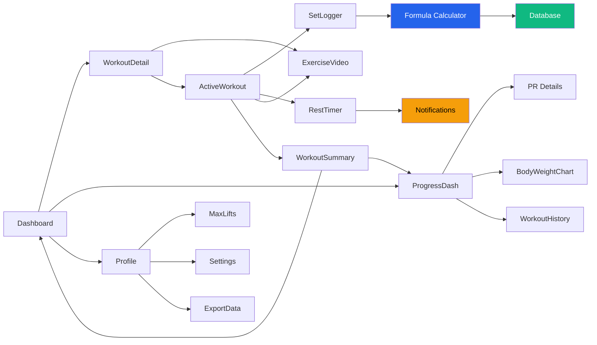

# My Mobile Trainer - UI Mockups & Visual Guide

## Screen-by-Screen Visual Mockups

### 1. Welcome & Onboarding Screens

#### Welcome Screen
```
╔═══════════════════════════════════════╗
║                                       ║
║                                       ║
║          💪 MY MOBILE TRAINER         ║
║                                       ║
║        Your Personal Strength         ║
║        Training Companion             ║
║                                       ║
║                                       ║
║     [Illustration: Person lifting]    ║
║                                       ║
║                                       ║
║                                       ║
║   ┌─────────────────────────────┐    ║
║   │     GET STARTED             │    ║
║   └─────────────────────────────┘    ║
║                                       ║
║        Based on Lance McCullough's    ║
║          "30 Minute Body"             ║
║                                       ║
╚═══════════════════════════════════════╝
```

#### Profile Setup Screen
```
╔═══════════════════════════════════════╗
║  ← Back                               ║
║                                       ║
║  Let's Get Started!                   ║
║  ─────────────────────────────────    ║
║                                       ║
║  What's your name?                    ║
║  ┌─────────────────────────────┐     ║
║  │  Enter your name            │     ║
║  └─────────────────────────────┘     ║
║                                       ║
║  Your fitness experience:             ║
║                                       ║
║  ┌─────────────────────────────┐     ║
║  │  ⭐ BEGINNER                │     ║
║  │  Over 1 month since I've    │     ║
║  │  worked out                 │     ║
║  └─────────────────────────────┘     ║
║                                       ║
║  ┌─────────────────────────────┐     ║
║  │  ⭐⭐ MODERATE               │     ║
║  │  Less than a month since    │     ║
║  │  weight training            │     ║
║  └─────────────────────────────┘     ║
║                                       ║
║              [CONTINUE]               ║
╚═══════════════════════════════════════╝
```

#### Body Weight Input Screen
```
╔═══════════════════════════════════════╗
║  ← Back                    Step 2/3   ║
║                                       ║
║  Record Your Body Weight              ║
║  ─────────────────────────────────    ║
║                                       ║
║  We'll track this over time to        ║
║  monitor your progress.               ║
║                                       ║
║                                       ║
║        ┌───┐   ┌─────┐   ┌───┐       ║
║        │ - │   │ 185 │   │ + │       ║
║        └───┘   └─────┘   └───┘       ║
║                  lbs                  ║
║                                       ║
║  Or enter manually:                   ║
║  ┌─────────────────────────────┐     ║
║  │  185                        │     ║
║  └─────────────────────────────┘     ║
║                                       ║
║                                       ║
║              [CONTINUE]               ║
║                                       ║
╚═══════════════════════════════════════╝
```

---

### 2. Main Dashboard

```
╔═══════════════════════════════════════╗
║  ☰  MY MOBILE TRAINER          🔔 ⚙️  ║
╠═══════════════════════════════════════╣
║                                       ║
║  Welcome back, Brandon! 👋            ║
║                                       ║
║  ┌─────────────────────────────────┐ ║
║  │  📅 WEEK 2 - DAY 1             │ ║
║  │  Chest & Back                  │ ║
║  │                                │ ║
║  │  🏋️ 5 Exercises  ⏱️ ~30 min   │ ║
║  │                                │ ║
║  │  [   START WORKOUT   ]         │ ║
║  └─────────────────────────────────┘ ║
║                                       ║
║  📊 Quick Stats                       ║
║  ┌─────────────┬─────────────────┐   ║
║  │ Workouts    │  Body Weight    │   ║
║  │ 8 this      │  185 lbs        │   ║
║  │ month       │  ↓ 3 lbs        │   ║
║  └─────────────┴─────────────────┘   ║
║                                       ║
║  🔥 Current Streak: 5 days            ║
║                                       ║
║  📈 Recent Progress                   ║
║  ┌─────────────────────────────────┐ ║
║  │  Bench Press:  245 lbs → 255 lbs│ ║
║  │  Lat Pull:     250 lbs → 255 lbs│ ║
║  └─────────────────────────────────┘ ║
║                                       ║
║  🎯 This Week's Goals:                ║
║  Continue to attempt new maxes...     ║
║                                       ║
╠═══════════════════════════════════════╣
║  [🏋️ Workout]  [📊 Progress]  [👤]   ║
╚═══════════════════════════════════════╝
```

---

### 3. Workout Detail Screen (Pre-Start)

```
╔═══════════════════════════════════════╗
║  ← Back                               ║
║                                       ║
║  WEEK 2 - DAY 1                       ║
║  Chest & Back                         ║
║                                       ║
║  📝 Today's Goals                     ║
║  This week we continue to attempt     ║
║  new maxes in some areas as well as   ║
║  go for max repetitions in others.    ║
║                                       ║
║  💡 Quick Tips                        ║
║  • Green fields need your input       ║
║  • Tap exercise name for video        ║
║  • Round to your gym's weights        ║
║                                       ║
║  ┌─────────────────────────────────┐ ║
║  │ ⚖️  RECORD BODY WEIGHT          │ ║
║  │     185 lbs                     │ ║
║  └─────────────────────────────────┘ ║
║                                       ║
║  📋 Exercises (5)                     ║
║                                       ║
║  ┌─────────────────────────────────┐ ║
║  │ 1️⃣ DUMBBELL INCLINE PRESS     ▼│ ║
║  │    Suggested: 75 lbs            │ ║
║  │    3 sets • 6-12 reps           │ ║
║  └─────────────────────────────────┘ ║
║  ┌─────────────────────────────────┐ ║
║  │ 2️⃣ LAT PULL DOWN              ▼│ ║
║  │    Suggested: 255 lbs           │ ║
║  │    4 sets • 6-12 reps           │ ║
║  └─────────────────────────────────┘ ║
║                                       ║
║         [  BEGIN WORKOUT  ]           ║
║                                       ║
╠═══════════════════════════════════════╣
║  [🏋️ Workout]  [📊 Progress]  [👤]   ║
╚═══════════════════════════════════════╝
```

---

### 4. Active Workout Screen

```
╔═══════════════════════════════════════╗
║  ✕ Exit        Week 2 Day 1    ⏸ Pause║
║                                       ║
║  Exercise 2 of 5                      ║
║  ━━━━━━━━━━━━━━━━━━━━━━━━━━━━ 40%    ║
║                                       ║
║  📹 LAT PULL DOWN                     ║
║  ┌─────────────────────────────────┐ ║
║  │                                 │ ║
║  │     [  WATCH VIDEO  ]           │ ║
║  │                                 │ ║
║  └─────────────────────────────────┘ ║
║                                       ║
║  Current Max: 250 lbs                 ║
║  Previous Workout: 215 lbs × 3 reps   ║
║                                       ║
║  ╔═══════════════════════════════╗   ║
║  ║  Set 2 of 4                   ║   ║
║  ╚═══════════════════════════════╝   ║
║                                       ║
║  Weight Used (lbs)                    ║
║  ┌────┐  ┌──────────┐  ┌────┐        ║
║  │ -5 │  │   215    │  │ +5 │        ║
║  └────┘  └──────────┘  └────┘        ║
║                                       ║
║  Reps Completed                       ║
║  ┌─────────────────────────────────┐ ║
║  │  [1] [2] [3] [4] [5] [6] ...   │ ║
║  └─────────────────────────────────┘ ║
║  Or enter: ___                        ║
║                                       ║
║  Rest: 1-2 MIN                        ║
║                                       ║
║  ┌─────────────────────────────────┐ ║
║  │   LOG SET & START REST TIMER    │ ║
║  └─────────────────────────────────┘ ║
║                                       ║
║  💡 Form Tip: Keep core tight, pull   ║
║     to chest, controlled descent      ║
║                                       ║
╚═══════════════════════════════════════╝
```

---

### 5. Rest Timer Screen

```
╔═══════════════════════════════════════╗
║                                       ║
║         REST PERIOD                   ║
║                                       ║
║                                       ║
║            ⏱️                          ║
║                                       ║
║            1:24                       ║
║                                       ║
║  ━━━━━━━━━━━━━━━━━━━━━━━━━━━ 70%     ║
║                                       ║
║                                       ║
║  💪 Last Set: 215 lbs × 3 reps        ║
║                                       ║
║  Next: Set 3 of 4                     ║
║                                       ║
║                                       ║
║  ┌─────────────────────────────────┐ ║
║  │      ADD 15 SECONDS             │ ║
║  └─────────────────────────────────┘ ║
║                                       ║
║  ┌─────────────────────────────────┐ ║
║  │      SKIP TIMER                 │ ║
║  └─────────────────────────────────┘ ║
║                                       ║
║                                       ║
║  💡 Catch your breath, hydrate!       ║
║                                       ║
╚═══════════════════════════════════════╝
```

---

### 6. Exercise Video Modal

```
╔═══════════════════════════════════════╗
║  ✕ Close                              ║
║                                       ║
║  ┌─────────────────────────────────┐ ║
║  │                                 │ ║
║  │        VIDEO PLAYER             │ ║
║  │                                 │ ║
║  │    [Exercise demonstration]     │ ║
║  │                                 │ ║
║  │    ▶️ ═══════════════ 0:45/2:10 │ ║
║  └─────────────────────────────────┘ ║
║                                       ║
║  Lat Pull Down                        ║
║  ─────────────────────────────────    ║
║                                       ║
║  📖 Instructions                      ║
║  1. Sit at lat pulldown machine       ║
║  2. Grip bar slightly wider than      ║
║     shoulder width                    ║
║  3. Pull bar down to upper chest      ║
║  4. Squeeze shoulder blades together  ║
║  5. Control the weight up             ║
║                                       ║
║  ⚠️ Form Tips                         ║
║  • Don't lean back excessively        ║
║  • Keep core engaged                  ║
║  • Full range of motion               ║
║  • Control the negative               ║
║                                       ║
║  🔄 Alternatives: Pull-ups, Band Rows ║
║                                       ║
╚═══════════════════════════════════════╝
```

---

### 7. Workout Summary Screen

```
╔═══════════════════════════════════════╗
║                                       ║
║           🎉 WORKOUT COMPLETE! 🎉     ║
║                                       ║
║  Week 2 - Day 1: Chest & Back         ║
║  Duration: 32 minutes                 ║
║  ─────────────────────────────────    ║
║                                       ║
║  📊 Workout Stats                     ║
║  ┌─────────────────────────────────┐ ║
║  │  Total Volume:     8,450 lbs    │ ║
║  │  Exercises:        5            │ ║
║  │  Sets Completed:   17           │ ║
║  │  Total Reps:       156          │ ║
║  └─────────────────────────────────┘ ║
║                                       ║
║  🏆 Personal Records                  ║
║  ┌─────────────────────────────────┐ ║
║  │  🆕 Bench Press: 255 lbs (new!) │ ║
║  │  💪 Lat Pull: 12 reps @ 255 lbs │ ║
║  └─────────────────────────────────┘ ║
║                                       ║
║  📝 Exercise Breakdown                ║
║  ┌─────────────────────────────────┐ ║
║  │  1. DB Incline Press            │ ║
║  │     75 × 6, 75 × 1, 75 × 1      │ ║
║  │  2. Lat Pull Down               │ ║
║  │     255 × 6, 215 × 3, 180 × 2   │ ║
║  │  ...                            │ ║
║  └─────────────────────────────────┘ ║
║                                       ║
║  [  VIEW DETAILED REPORT  ]           ║
║  [  DONE  ]                           ║
║                                       ║
╚═══════════════════════════════════════╝
```

---

### 8. Progress Dashboard

```
╔═══════════════════════════════════════╗
║  Progress                       🔍 ⚙️  ║
╠═══════════════════════════════════════╣
║                                       ║
║  📈 Body Weight Trend                 ║
║  ┌─────────────────────────────────┐ ║
║  │     188 ┤          ⋰            │ ║
║  │     186 ┤       ⋰               │ ║
║  │     184 ┤    ⋰                  │ ║
║  │     182 ┤ ⋰                     │ ║
║  │         └──────────────────     │ ║
║  │         W1   W2   W3   W4       │ ║
║  │                                 │ ║
║  │  Current: 185 lbs  ↓ 3 lbs     │ ║
║  └─────────────────────────────────┘ ║
║                                       ║
║  🏆 Personal Records                  ║
║  ┌─────────────────────────────────┐ ║
║  │  Bench Press          255 lbs  >│ ║
║  │  Lat Pull Down        265 lbs  >│ ║
║  │  Leg Press            350 lbs  >│ ║
║  │  Shoulder Press        80 lbs  >│ ║
║  └─────────────────────────────────┘ ║
║                                       ║
║  📅 Workout Calendar                  ║
║  ┌─────────────────────────────────┐ ║
║  │  M  T  W  T  F  S  S            │ ║
║  │  ✓  -  ✓  -  ✓  -  -            │ ║
║  │  ✓  -  ✓  -  ✓  -  -            │ ║
║  └─────────────────────────────────┘ ║
║                                       ║
║  [  VIEW DETAILED STATS  ]            ║
║                                       ║
╠═══════════════════════════════════════╣
║  [🏋️ Workout]  [📊 Progress]  [👤]   ║
╚═══════════════════════════════════════╝
```

---

### 9. Personal Records Detail

```
╔═══════════════════════════════════════╗
║  ← Back                               ║
║                                       ║
║  🏆 Personal Records                  ║
║  ─────────────────────────────────    ║
║                                       ║
║  Filter: [All] [Chest] [Back] [Legs]  ║
║                                       ║
║  ┌─────────────────────────────────┐ ║
║  │  💪 BENCH PRESS                 │ ║
║  │  ─────────────────────────────  │ ║
║  │  Current Max: 255 lbs           │ ║
║  │  Achieved: Jan 3, 2026          │ ║
║  │  Previous: 245 lbs (+10 lbs)    │ ║
║  │                                 │ ║
║  │  📈 Progress Chart              │ ║
║  │  225 ──── 235 ──── 245 ──── 255│ ║
║  │  Dec    Dec      Jan      Jan   │ ║
║  │  15     22       1        3     │ ║
║  └─────────────────────────────────┘ ║
║                                       ║
║  ┌─────────────────────────────────┐ ║
║  │  💪 LAT PULL DOWN               │ ║
║  │  ─────────────────────────────  │ ║
║  │  Current Max: 265 lbs           │ ║
║  │  Achieved: Jan 5, 2026          │ ║
║  │  Previous: 250 lbs (+15 lbs)    │ ║
║  │  📈 [Chart]                     │ ║
║  └─────────────────────────────────┘ ║
║                                       ║
║                                       ║
╠═══════════════════════════════════════╣
║  [🏋️ Workout]  [📊 Progress]  [👤]   ║
╚═══════════════════════════════════════╝
```

---

### 10. Max Determination Week Screen

```
╔═══════════════════════════════════════╗
║  ← Back                               ║
║                                       ║
║  🎯 MAX DETERMINATION WEEK            ║
║  Day 1: Chest & Back                  ║
║                                       ║
║  ⚠️ IMPORTANT - READ FIRST            ║
║  ┌─────────────────────────────────┐ ║
║  │  This week establishes your     │ ║
║  │  baseline strength levels.      │ ║
║  │                                 │ ║
║  │  • Start light for warm-up      │ ║
║  │  • Gradually increase weight    │ ║
║  │  • Stop at your true max        │ ║
║  │  • Maintain proper form         │ ║
║  │  • Take full 2-min rests        │ ║
║  └─────────────────────────────────┘ ║
║                                       ║
║  📹 WATCH: How to Max Properly        ║
║  [Essential viewing before starting]   ║
║                                       ║
║  Today's Exercises:                   ║
║  1️⃣ Bench Press (Max Test)            ║
║  2️⃣ Lat Pull Down (Max Test)          ║
║  3️⃣ Machine Low Row (Max Test)        ║
║  4️⃣ Machine High Row (Max Test)       ║
║                                       ║
║  ⏱️ Expected Duration: 45-60 min      ║
║                                       ║
║         [  I'M READY - START  ]       ║
║                                       ║
╚═══════════════════════════════════════╝
```

---

### 11. Max Testing Exercise Screen

```
╔═══════════════════════════════════════╗
║  ✕ Exit                        1 of 4 ║
║                                       ║
║  🎯 BENCH PRESS - MAX TEST            ║
║                                       ║
║  Instructions:                        ║
║  Complete sets progressively until    ║
║  you reach your 1-rep max.            ║
║                                       ║
║  ┌─────────────────────────────────┐ ║
║  │  Set 1:  ✓  85 lbs × 1 rep      │ ║
║  │  Set 2:  ✓  135 lbs × 1 rep     │ ║
║  │  Set 3:  ✓  155 lbs × 1 rep     │ ║
║  │  Set 4:  ✓  170 lbs × 1 rep     │ ║
║  │  Set 5:  ✓  185 lbs × 1 rep     │ ║
║  │  Set 6:  ✓  205 lbs × 1 rep     │ ║
║  │  Set 7:  ✓  225 lbs × 1 rep     │ ║
║  │  Set 8:  ✓  240 lbs × 1 rep     │ ║
║  │  Set 9:  ✓  250 lbs × 1 rep     │ ║
║  │  Set 10: →  260 lbs             │ ║
║  └─────────────────────────────────┘ ║
║                                       ║
║  Current Set Weight (lbs)             ║
║  ┌────┐  ┌──────────┐  ┌────┐        ║
║  │ -5 │  │   260    │  │ +5 │        ║
║  └────┘  └──────────┘  └────┘        ║
║                                       ║
║  Rest: 2 MIN       ⏱️ Ready!          ║
║                                       ║
║  Did you complete 1 rep?              ║
║  [  YES - LOG SET  ]  [  NO - DONE  ] ║
║                                       ║
║  If NO, your max is: 250 lbs          ║
║                                       ║
╚═══════════════════════════════════════╝
```

---

### 12. Exercise Alternate Selection

```
╔═══════════════════════════════════════╗
║  ← Back                               ║
║                                       ║
║  Select Exercise Variant              ║
║  ─────────────────────────────────    ║
║                                       ║
║  Chest Press Exercises:               ║
║                                       ║
║  ┌─────────────────────────────────┐ ║
║  │  ⭐ BENCH PRESS (Primary)       │ ║
║  │  Barbell | Chest Focus          │ ║
║  │  Your Max: 255 lbs              │ ║
║  └─────────────────────────────────┘ ║
║                                       ║
║  ┌─────────────────────────────────┐ ║
║  │  🔄 MACHINE PRESS               │ ║
║  │  Machine | Chest Focus          │ ║
║  │  Equivalent Max: ~215 lbs       │ ║
║  └─────────────────────────────────┘ ║
║                                       ║
║  ┌─────────────────────────────────┐ ║
║  │  🔄 DUMBBELL INCLINE PRESS      │ ║
║  │  Dumbbell | Upper Chest         │ ║
║  │  Equivalent Max: ~75 lbs ea.    │ ║
║  └─────────────────────────────────┘ ║
║                                       ║
║  💡 Why alternate?                    ║
║  Switch if equipment isn't available  ║
║  or you want exercise variety         ║
║                                       ║
║              [CANCEL]                 ║
║                                       ║
╚═══════════════════════════════════════╝
```

---

### 13. Profile Screen

```
╔═══════════════════════════════════════╗
║  Profile                        ⚙️     ║
╠═══════════════════════════════════════╣
║                                       ║
║         👤                            ║
║       Brandon                         ║
║                                       ║
║  📊 Current Stats                     ║
║  ┌─────────────────────────────────┐ ║
║  │  Current Week:     Week 2       │ ║
║  │  Experience:       Beginner     │ ║
║  │  Body Weight:      185 lbs      │ ║
║  │  Total Workouts:   8            │ ║
║  │  Current Streak:   5 days       │ ║
║  └─────────────────────────────────┘ ║
║                                       ║
║  🎯 My Max Lifts                   >  ║
║  ┌─────────────────────────────────┐ ║
║  │  View and manage your maximum   │ ║
║  │  lift records                   │ ║
║  └─────────────────────────────────┘ ║
║                                       ║
║  📱 Settings                       >  ║
║  ┌─────────────────────────────────┐ ║
║  │  Preferences, notifications,    │ ║
║  │  units, and more                │ ║
║  └─────────────────────────────────┘ ║
║                                       ║
║  📤 Export Data                    >  ║
║  ┌─────────────────────────────────┐ ║
║  │  Download your workout history  │ ║
║  └─────────────────────────────────┘ ║
║                                       ║
║  📖 About the Program              >  ║
║                                       ║
╠═══════════════════════════════════════╣
║  [🏋️ Workout]  [📊 Progress]  [👤]   ║
╚═══════════════════════════════════════╝
```

---

### 14. Settings Screen

```
╔═══════════════════════════════════════╗
║  ← Profile                            ║
║                                       ║
║  ⚙️ Settings                          ║
║  ─────────────────────────────────    ║
║                                       ║
║  🎯 Workout Preferences               ║
║  ┌─────────────────────────────────┐ ║
║  │  Default Rest Timer              │ ║
║  │  ◉ Auto-start  ○ Manual start   │ ║
║  └─────────────────────────────────┘ ║
║  ┌─────────────────────────────────┐ ║
║  │  Weight Units                    │ ║
║  │  ◉ Pounds (lbs)  ○ Kilograms    │ ║
║  └─────────────────────────────────┘ ║
║  ┌─────────────────────────────────┐ ║
║  │  Weight Increments               │ ║
║  │  ◉ 2.5/5 lbs  ○ 5/10 lbs        │ ║
║  └─────────────────────────────────┘ ║
║                                       ║
║  🔔 Notifications                     ║
║  ┌─────────────────────────────────┐ ║
║  │  Workout Reminders      [ON]    │ ║
║  │  Rest Timer Alerts      [ON]    │ ║
║  │  Achievement Alerts     [ON]    │ ║
║  └─────────────────────────────────┘ ║
║                                       ║
║  🎨 Appearance                        ║
║  ┌─────────────────────────────────┐ ║
║  │  Theme                           │ ║
║  │  ◉ Auto  ○ Light  ○ Dark        │ ║
║  └─────────────────────────────────┘ ║
║                                       ║
║  ℹ️ About                             ║
║  Version 1.0.0                        ║
║  [Privacy Policy] [Terms] [Support]   ║
║                                       ║
╠═══════════════════════════════════════╣
║  [🏋️ Workout]  [📊 Progress]  [👤]   ║
╚═══════════════════════════════════════╝
```

---

## Interaction Patterns

### Gesture Controls

1. **Swipe Right** (on workout detail): View quick tips panel
2. **Swipe Left** (on exercise card): Quick access to alternatives
3. **Long Press** (on exercise name): Quick preview video
4. **Pull to Refresh** (on progress screens): Update stats
5. **Pinch/Zoom** (on charts): Detailed view

### Haptic Feedback Points

- ✓ Set logged successfully
- ⏱️ Rest timer complete
- 🏆 New personal record achieved
- ⚠️ Form warning acknowledged
- ✅ Workout completed

---

## Animation & Transitions

### Micro-animations
- **Set completion**: Checkmark animation + confetti for PRs
- **Weight adjustment**: Smooth number counter animation
- **Rest timer**: Circular progress ring
- **Screen transitions**: Slide from right/left
- **Tab switches**: Fade with slight scale
- **Exercise expand**: Smooth accordion
- **Progress charts**: Animated line drawing

### Loading States
```
While calculating weights:
┌─────────────────────┐
│  ⟳ Calculating...   │
│  Personalizing      │
│  your workout       │
└─────────────────────┘

While loading workout:
┌─────────────────────┐
│  Loading Week 2     │
│  Day 1...           │
│  ━━━━━━━━━━ 70%     │
└─────────────────────┘
```

---

## Empty States

### No Workouts Yet
```
╔═══════════════════════════════════════╗
║                                       ║
║           🏋️                          ║
║                                       ║
║     Start Your First Workout!         ║
║                                       ║
║  You haven't started any workouts     ║
║  yet. Let's build the foundation      ║
║  of your fitness journey!             ║
║                                       ║
║                                       ║
║      [  BEGIN YOUR JOURNEY  ]         ║
║                                       ║
╚═══════════════════════════════════════╝
```

### No Progress Data
```
╔═══════════════════════════════════════╗
║                                       ║
║           📊                          ║
║                                       ║
║     No Progress Data Yet              ║
║                                       ║
║  Complete your first few workouts     ║
║  to see your progress tracked here!   ║
║                                       ║
║                                       ║
║      [  START WORKOUT  ]              ║
║                                       ║
╚═══════════════════════════════════════╝
```

---

## Notification Examples

### Push Notification Designs

```
🔔 Time to Train!
Your Week 2 Day 2 workout is ready.
Let's crush those legs! 💪
[View Workout]

🎉 New Personal Record!
Bench Press: 255 lbs
You're getting stronger! 🏆
[View Stats]

⏰ Rest Timer Complete
Time for your next set!
[Open App]

🔥 5-Day Streak!
You're on fire! Keep it going.
[Continue Streak]
```

---

## Dark Mode Design

### Dark Mode Color Adjustments
```
Background:     #000000 → #121212 (elevated surfaces)
Cards:          #FFFFFF → #1E1E1E
Text Primary:   #1F2937 → #E5E5E5
Text Secondary: #6B7280 → #9CA3AF
Borders:        #E5E7EB → #374151

Keep vibrant:
- Success Green: #10B981 (slightly brighter)
- Energy Blue: #3B82F6
- Warning: #FBBF24
```

### Dark Mode Example - Dashboard
```
╔═══════════════════════════════════════╗
║  ☰  MY MOBILE TRAINER    [Dark] 🔔 ⚙️ ║
╠═══════════════════════════════════════╣
║  ░░░░░░░░░░░░░░░░░░░░░░░░░░░░░░░░░  ║
║  ░                                 ░  ║
║  ░  Welcome back, Brandon! 👋      ░  ║
║  ░                                 ░  ║
║  ░  ┌───────────────────────────┐ ░  ║
║  ░  │░ 📅 WEEK 2 - DAY 1       │ ░  ║
║  ░  │░ Chest & Back            │ ░  ║
║  ░  │░                         │ ░  ║
║  ░  │░ [   START WORKOUT   ]   │ ░  ║
║  ░  └───────────────────────────┘ ░  ║
║  ░                                 ░  ║
║  ░░░░░░░░░░░░░░░░░░░░░░░░░░░░░░░░░  ║
║                                       ║
║  [Lighter backgrounds for cards]      ║
║  [White/light gray text]              ║
║  [Preserved accent colors]            ║
╚═══════════════════════════════════════╝
```

---

## Accessibility Features

### Screen Reader Optimization
```
<TouchableOpacity
  accessible={true}
  accessibilityLabel="Start workout for Week 2 Day 1, Chest and Back"
  accessibilityHint="Double tap to begin your workout session"
  accessibilityRole="button"
>
  <Text>START WORKOUT</Text>
</TouchableOpacity>

<Text
  accessible={true}
  accessibilityLabel="Suggested weight: 215 pounds"
>
  Suggested: 215 lbs
</Text>
```

### Dynamic Type Support
- Support iOS Dynamic Type sizes
- Support Android font scaling
- Test at 200% font size
- Ensure touch targets remain adequate

---

## Offline Functionality

### What Works Offline
✅ All workout logging
✅ View exercise library
✅ Access previous workout history
✅ View progress charts
✅ Calculate suggested weights

### What Requires Internet
⚠️ Watch exercise videos (unless cached)
⚠️ Cloud backup (Phase 2)
⚠️ Download program updates

### Offline Indicator
```
╔═══════════════════════════════════════╗
║  ⚠️ Offline Mode                      ║
║  Videos unavailable. Your workout     ║
║  data is saved locally.               ║
╚═══════════════════════════════════════╝
```

---

## User Onboarding Tooltips

### First Workout Tooltips
```
Step 1: [Highlight exercise name]
"Tap here to watch the exercise video
 and learn proper form"

Step 2: [Highlight weight input]
"Enter the weight you actually used.
 We've suggested a weight based on
 your max, but adjust as needed."

Step 3: [Highlight reps input]
"Log how many reps you completed.
 Be honest - this helps us suggest
 better weights next time!"

Step 4: [Highlight rest timer]
"After logging a set, the rest timer
 will start automatically. Rest up!"

Step 5: [Highlight complete button]
"When you've finished all sets,
 move to the next exercise."
```

---

## Error States & Validation

### Input Validation Messages

```
Weight Input Errors:
┌────────────────────────────┐
│  ⚠️ Weight seems too high  │
│  Your max is 250 lbs.      │
│  Did you mean 265?         │
│  [YES] [NO, USE 465]       │
└────────────────────────────┘

Reps Input Errors:
┌────────────────────────────┐
│  ℹ️ Target: 1-3 reps       │
│  You logged: 15 reps       │
│  Weight might be too light?│
│  [OK, NOTED]               │
└────────────────────────────┘

Max Test Warning:
┌────────────────────────────┐
│  ⚠️ Safety Check           │
│  Going from 225 to 260 lbs?│
│  Try 240 lbs first?        │
│  [TRY 240] [NO, USE 260]   │
└────────────────────────────┘
```

---

## Progressive Disclosure

### Information Architecture

**Level 1 - Dashboard**: Overview, quick actions
**Level 2 - Workout Detail**: Exercise list, suggestions
**Level 3 - Active Workout**: Set-by-set guidance
**Level 4 - Exercise Info**: Videos, form tips, alternatives

**Level 1 - Progress**: Key metrics, trends
**Level 2 - Detailed Stats**: Charts, history
**Level 3 - Exercise Deep Dive**: Exercise-specific progress

This layered approach prevents information overload while keeping everything accessible.

---

## Component Interaction Map



---

## Responsive Design Considerations

### Small Devices (iPhone SE, older Android)
- **Compact layouts**: Reduce padding/margins
- **Stacked elements**: Single column when needed
- **Smaller fonts**: Minimum 14px body text
- **Scrollable content**: Accept vertical scrolling

### Large Devices (iPhone Pro Max, tablets)
- **Multi-column layouts**: Show more information
- **Larger touch targets**: More generous spacing
- **Landscape support**: Side-by-side exercise video + logging
- **Split view**: Exercise list + detail view

### Tablets (Optional)
- **Master-detail layout**: Exercise list + active workout side-by-side
- **Larger charts**: More detailed visualizations
- **Picture-in-picture**: Video while logging

---

## Real-Time Feedback Mechanisms

### During Workout
```
Performance Indicators:

✅ Great! (Exceeded target reps)
┌────────────────────────────┐
│  💪 Nice work!             │
│  You crushed that set!     │
│  +5 lbs next time          │
└────────────────────────────┘

⚠️ Struggle (Failed target reps)
┌────────────────────────────┐
│  Keep at it!               │
│  -5 lbs next set to build  │
│  volume and confidence     │
└────────────────────────────┘

🎯 Perfect (Hit target exactly)
┌────────────────────────────┐
│  Right on target!          │
│  Maintaining weight        │
└────────────────────────────┘
```

---

## Data Export Format Examples

### CSV Export Structure
```csv
Date,Week,Day,Exercise,Set,Weight,Reps,Rest,Notes
2026-01-03,2,1,Bench Press,1,205,6,30,
2026-01-03,2,1,Bench Press,2,215,1,90,
2026-01-03,2,1,Bench Press,3,225,1,90,
2026-01-03,2,1,Lat Pull Down,1,255,6,30,
...
```

### PDF Report Layout
```
═══════════════════════════════════════
  MY MOBILE TRAINER - WORKOUT REPORT
═══════════════════════════════════════

User: Brandon
Date Range: Dec 15, 2025 - Jan 5, 2026
Total Workouts: 8

─────────────────────────────────────────
STRENGTH PROGRESSION
─────────────────────────────────────────
Bench Press:     225 → 255 lbs (+30)
Lat Pull Down:   250 → 265 lbs (+15)
Leg Press:       300 → 350 lbs (+50)
Shoulder Press:  70 → 80 lbs (+10)

─────────────────────────────────────────
BODY WEIGHT TREND
─────────────────────────────────────────
Start:   188 lbs
Current: 185 lbs
Change:  -3 lbs

[Chart visualization]

─────────────────────────────────────────
WORKOUT HISTORY
─────────────────────────────────────────

Week 1, Day 1 - Chest & Back
Date: Dec 15, 2025
Duration: 28 minutes
...
```

---

## Platform-Specific Considerations

### iOS-Specific Features
- **SF Symbols** for icons
- **Haptic Engine** for feedback
- **Face ID / Touch ID** for app lock
- **Siri Shortcuts** (future): "Start my workout"
- **Apple Health integration** (future)
- **Today Widget**: Quick workout access

### Android-Specific Features
- **Material Design 3** components
- **Biometric authentication**
- **Home screen widgets**
- **Google Fit integration** (future)
- **Share sheets** for workout sharing

---

## App Store Assets Planning

### Screenshots Required (per platform)
1. Dashboard with stats
2. Active workout in progress
3. Exercise video demonstration
4. Progress charts
5. Personal records achievements

### App Store Description Keywords
- Strength training
- Progressive overload
- Workout tracker
- Personal trainer
- Weight lifting
- Fitness program
- 30-minute workouts

### App Icon Concept
```
┌─────────────┐
│   ┌───┐     │  Clean, modern design
│   │💪 │     │  Blue gradient background
│   └───┘     │  White dumbbell icon
│             │  "MMT" text optional
└─────────────┘
```

---

## Summary of Visual Design

This UI guide provides pixel-perfect mockups and interaction patterns for the "My Mobile Trainer" app. Key design principles:

1. **Clarity First**: Large, readable text and obvious CTAs
2. **In-Workout Optimization**: Big touch targets, minimal friction
3. **Motivational Design**: Celebrate achievements, positive reinforcement
4. **Progressive Disclosure**: Don't overwhelm, reveal as needed
5. **Accessibility**: Support all users regardless of abilities
6. **Platform Native**: Feel natural on both iOS and Android

The visual design balances professional fitness app aesthetics with the approachable, encouraging tone of a personal trainer.
